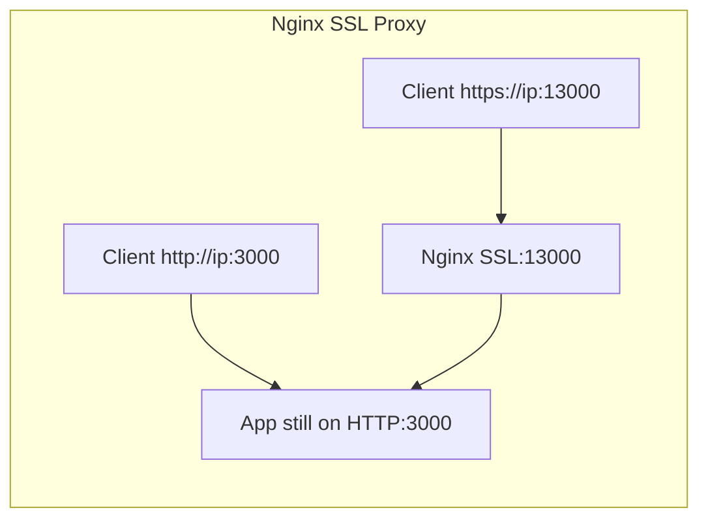
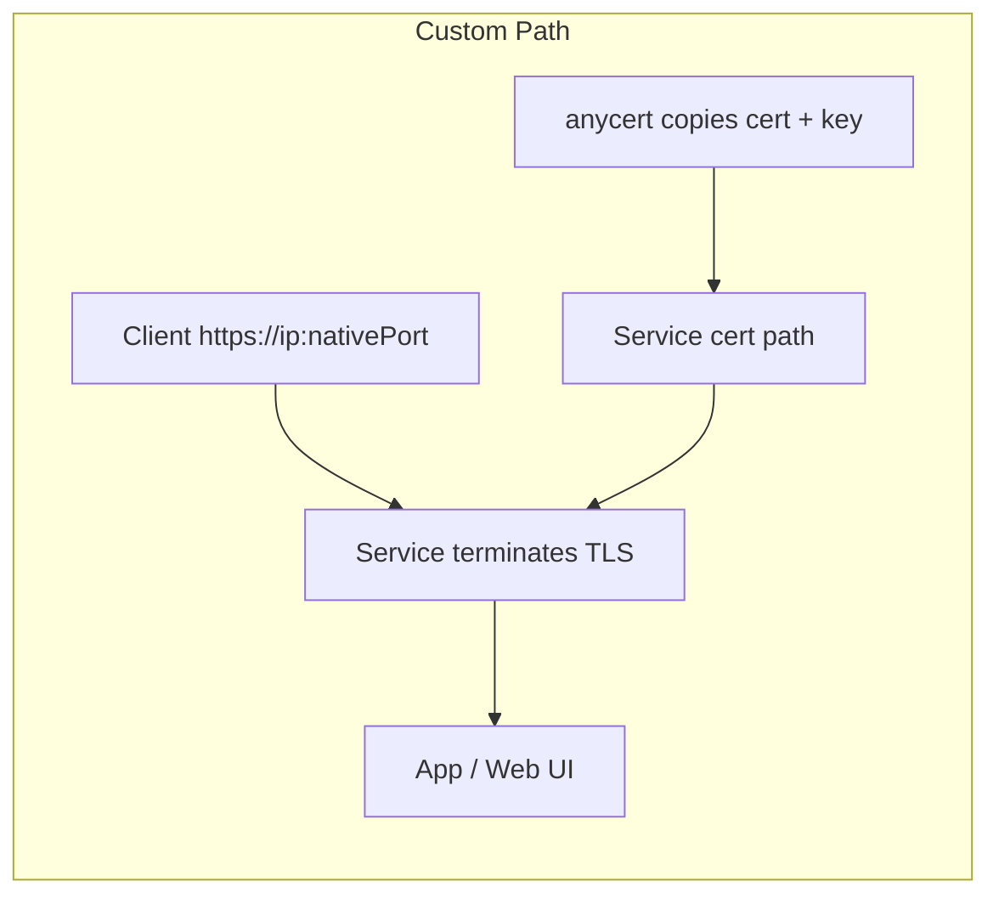
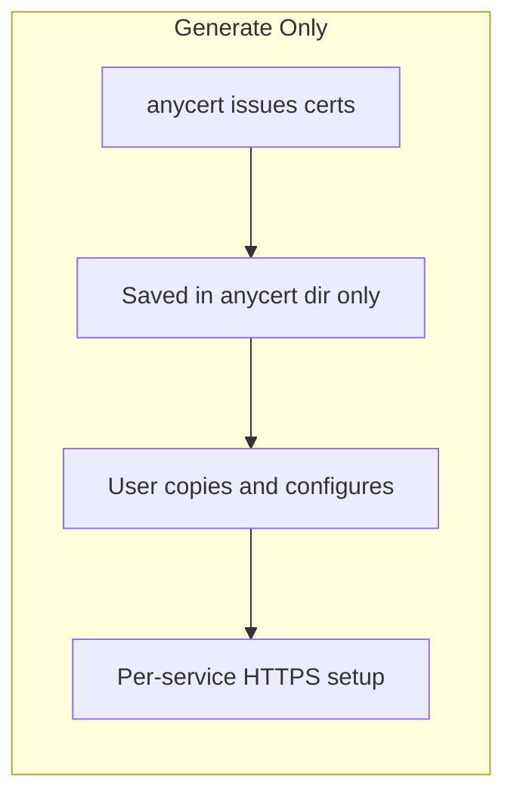
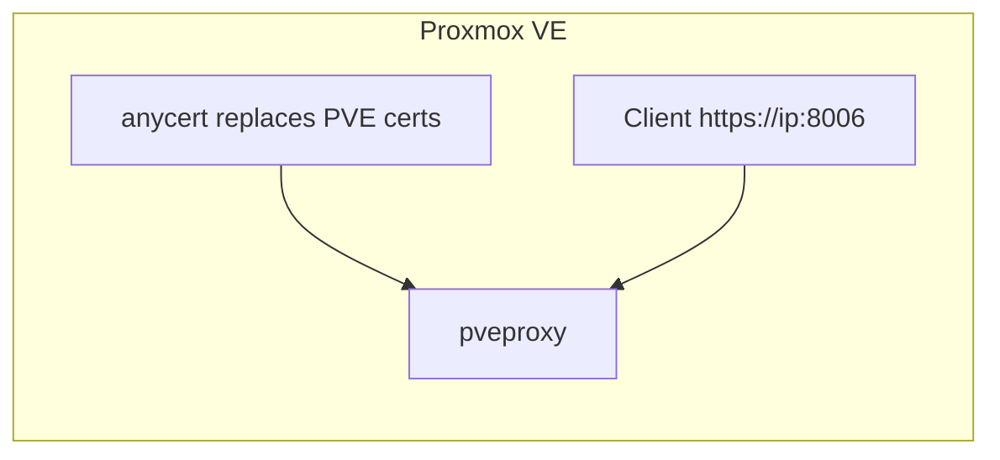

# anycert — Self-Hosted HTTPS Certificate Manager, Trusted by Every Client

Permanently eliminate browser certificate warnings for your self-hosted servers. Supports Proxmox VE, OpenMediaVault, Unraid, local LLM servers, Nginx, and any internal TLS/HTTPS service.

One command on the server, one command on each client. Get a green lock in your browser, valid for 10 years, fully offline, and requiring no public domains or DNS records.

**English** | [繁體中文](README_tw.md)

---

## File Description

### Server-side (Generator & Installer)
| File | Platform | Usage |
|------|----------|-------|
| `anycert.sh` | Linux (including WSL) / macOS Server | Generates Root CA + Server cert, supports PVE, Nginx SSL Proxy (Recommended), Custom Paths, and reload commands |
| `anycert.bat` | Windows Server | Generates Root CA + Server cert, supports Nginx SSL Proxy (Recommended), Custom Paths, and reload commands |

### Client-side (Downloader & Truster)
| File | Platform | Usage |
|------|----------|-------|
| `anycert-windows.bat` | Windows Client | Downloads CA cert, updates hosts, imports to Windows Trust Store |
| `anycert-linux.sh` | Linux Client (Ubuntu/Debian) | Downloads CA cert, updates hosts, imports to system and browser (Chrome/Firefox) Trust Stores |
| `anycert-macos.sh` | macOS Client | Downloads CA cert, updates hosts, imports to macOS Keychain |

---

## Why anycert? (Comparison Table)

How does `anycert` compare with other internal TLS/HTTPS solutions?

| Feature | **Default Self-Signed** | **Let's Encrypt (DNS-01 / Cloudflare)** | **Tunnels (Cloudflared / ngrok)** | **Mesh VPN (Tailscale HTTPS)** | **anycert (This Script)** |
|---|---|---|---|---|---|
| **Browser Lock 🔒** | ❌ Warnings (Must re-trust every year) | ✅ Yes | ✅ Yes | ✅ Yes | ✅ Yes (After client setup) |
| **Needs Public Domain** | ✅ No | ❌ Yes | ❌ Yes | ✅ No | ✅ No |
| **Needs Internet** | ✅ No | ❌ Yes | ❌ Must be online | ❌ Must be online | ✅ No — Works 100% offline |
| **Exposes Hostname** | ✅ No | ❌ Yes (CT logs) | ❌ Yes (CT logs) | ✅ No | ✅ No |
| **Isolated LAN Support** | ✅ Yes | ❌ No | ❌ No | ❌ No | ✅ Yes |
| **Client Reconfig on Renew**| ❌ Yes (Every year) | ✅ No | ✅ No | ✅ No | ✅ No — Root CA stays trusted |
| **LAN Data Stays Local** | ✅ Yes | ✅ Yes | ❌ No (Via edge nodes) | ❌ No (Often routes via DERPs/relays) | ✅ Yes — Full LAN speeds |
| **Multi-Client Setup** | Manual trust on every client per renew | Automatic | Automatic | Requires client agent on all machines | Run client script once per client |
| **Cost** | Free | Free | Free / Paid plans | Free / Paid plans | Free |
| **FQDN Access** | ✅ Yes (With warning) | ✅ Yes | ✅ Yes | ✅ Yes (Limit `*.ts.net`) | ✅ Yes |
| **IP Access** | ✅ Yes (With warning) | ❌ No | ❌ No | ❌ No | ✅ Yes (SAN contains IP) |
| **Complexity** | None | High | Medium | Medium | Low |

### Best Use Cases
- **Let's Encrypt + Cloudflare**: Best for homelabs with public domains where you don't mind exposing hostnames to public Certificate Transparency logs.
- **Cloudflared / ngrok**: Good for exposing internal services to the public internet, but poses security risks and fails in offline/LAN environments.
- **Tailscale HTTPS**: Great if your entire fleet is already on Tailscale, but requires an active internet connection to update certificates and forces you to use `*.ts.net` domains.
- **anycert**: Ideal for **fully offline, air-gapped, or secure internal LANs** where no public exposure is wanted, data privacy is critical, and direct IP access is preferred.

---

## 🔒 Why Local HTTPS Matters?

Using HTTPS on a local area network (LAN) provides critical benefits beyond simply **eliminating browser warning screens**:

### 1. Enabling Modern Browser APIs (Secure Contexts Enforcement)
Modern browsers (like Chrome, Safari, Edge) enforce strict security policies that disable many powerful web APIs unless the page is loaded in a **"Secure Context"** (i.e., over `https://` or on `http://localhost` **only when accessed locally on the server machine**).

If you connect from other devices on the LAN (like your phone, tablet, or another laptop) using plain `http://` with a local IP or custom FQDN, the browser will flag the connection as insecure and **forcefully disable**:
- **Clipboard Operations (Clipboard API)**: This is a major pain point! In local LLM chat applications (e.g., Open WebUI, LLMChat), clicking the **"Copy Code"** button on code blocks will **completely fail** under HTTP cross-device connections.
- **Microphone & Camera Access**: Speech-to-Text inputs and AI voice chat features **cannot access your microphone** if the URL is not HTTPS.
- **PWA Installation (Progressive Web Apps)**: You cannot install local web apps to your desktop or mobile home screen, nor can you use offline features (Service Workers).
- **Hardware Integration**: Gamepad API (game controllers), WebBluetooth, WebUSB, and MIDI keyboard integrations will be disabled.
- **Credential APIs & Passwordless Login (Web Crypto / Passkeys)**: Generating or registering passkeys requires HTTPS.

### 2. Protecting Credentials and Tokens from Local Sniffing
In shared network environments (such as offices, schools, co-living spaces, or public Wi-Fi), unencrypted HTTP traffic can be easily sniffed by anyone on the same network using tools like Wireshark. HTTPS encrypts all communication, preventing:
- Theft of login credentials to your self-hosted services.
- Sniffing of sensitive AI API Keys (such as OpenAI/Anthropic tokens) transmitted to local LLMs.
- Local eavesdropping on private LLM chats and database payloads.

---

## 💡 Key Mechanism: 10-Year CA vs. 825-Day Server Cert

**Why is the Root CA valid for 10 years (3650 days), while the server cert is only 825 days?**
Modern operating systems and browsers (like Apple iOS/macOS Safari and Google Chrome) enforce a strict security policy: any leaf SSL/TLS server certificate signed by a private CA must have a maximum validity of **825 days** (approx. 2.2 years). If it exceeds 825 days, the browser will block the connection with an invalid certificate warning.

To bypass this restriction while providing a seamless user experience, `anycert` uses a dual-layer setup:
1. **Root CA (10 years)**: Installed and trusted on the client device. It remains unchanged.
2. **Server Certificate (825 days)**: Installed on the server.
Since the Root CA trusted by your clients remains unchanged, **when the server certificate expires, you only run the script on the server to regenerate it. The clients will automatically trust it without any re-importing or reconfiguration.** This achieves the "configure once, trusted forever" convenience.

---

## Installation Steps

### Step 1 — On the Server (Generate Certs)

#### Linux (including WSL) / macOS Server:
Clone this repo and run `anycert.sh`:
```bash
git clone https://github.com/anomixer/anycert.git
cd anycert
sudo bash anycert.sh
```
The script will:
1. Auto-detect your IP, hostname, and FQDN.
2. Let you choose a deployment profile (offers **3 options** on standard servers, and auto-detects Proxmox VE to offer **4 options**):
   - **Auto-Setup Nginx SSL Proxy [Lazy-Friendly / Recommended]**: Scans listening TCP ports, lets you pick which ones to expose, automatically installs Nginx, and builds HTTPS wrappers (`Port+10000` to `HTTP Port`).
   - **Proxmox VE (PVE)**: *(Only displayed on PVE systems)* Automatically backs up and replaces the default PVE certs, then restarts `pveproxy`.
   - **Custom Path**: Installs certs to custom target paths and runs a custom service reload command (for services that **already support native HTTPS**).
   - **Generate Only [Painful / Hard Way]**: Just generates the certificates in `/etc/anycert/` for manual setup.

> **Menu numbering note**: On `anycert.sh` (standard servers), options are `[1] Nginx` / `[2] Custom` / `[3] Generate Only`. On `anycert.bat`, they are `[1] Custom` / `[2] Nginx (default)` / `[3] Generate Only`. The diagrams below are labeled by **profile name**, not menu number.

**Traffic flow by profile:**

**Nginx SSL Proxy** — Best for plain HTTP services or multi-container setups. Apps keep their HTTP port; HTTPS is served on `Port + 10000`:



**Custom Path** — Best when the service **already terminates HTTPS** (PVE, OMV, IIS, your own Nginx, etc.). Certs are copied in-place; clients use the **native port**:



**Generate Only** — Issues and saves cert files only; you configure each service manually afterward:



**Proxmox VE (Linux PVE only)** — Automated Custom Path; replaces `pveproxy` certs directly:



#### Windows Server:
Run Command Prompt (cmd) as **Administrator** and execute:
```cmd
anycert.bat
```
The script will search for OpenSSL (e.g. from Git for Windows), generate the certificates, and allow you to deploy them using the Nginx automatic proxy (automatic download & setup) or to custom paths (e.g. IIS).

> [!TIP]
> **✨ Smart Configuration & Update Menu**
> If your server already has anycert certificates installed, executing `anycert.sh` or `anycert.bat` again will automatically detect the installation and present an action menu:
> 1. **Update/Modify Nginx Ports**: Change proxy port mappings without regenerating certificates.
>    - **Overwrite Mode**: Enter a space-separated list of ports (e.g. `3000 8080`) to completely overwrite the current ports.
>    - **Adjustment Mode**: Prefix ports with `+` or `-` (e.g. `+8080 -3000`) to incrementally add `8080` and remove `3000` from Nginx proxy wrappers. Nginx configuration will reload automatically.
> 2. **Renew/Regenerate SSL Certificates**: Keeps the existing Nginx proxy ports configuration but renews expired server certificates.
> 3. **Uninstall**: Completely restores the original settings and cleans up certificate directories.

---

### Step 2 — On Each Client (Trust the CA)

Run the script matching your client operating system:

#### Windows Client:
Right-click `anycert-windows.bat` → **Run as Administrator**.
```cmd
anycert-windows.bat
```

#### Linux Client (Ubuntu / Debian):
```bash
sudo bash anycert-linux.sh
```

#### macOS Client:
```bash
sudo bash anycert-macos.sh
```

The client scripts will:
1. Ask for the Server IP and SSH username.
2. **Smart Transmission & CA Download**:
   - **SCP Download**: Attempts to safely copy the Root CA certificate using SCP first.
   - **SMB Fallback (Specifically for Windows Server)**: If the remote server is running Windows and SSH is unavailable (causing SCP to fail), the client script will automatically fall back to the **Windows SMB (Port 445) channel**.
     - *Linux Client*: Automatically checks and installs `smbclient` if missing, then fetches the certificate directly.
     - *macOS Client*: Uses the native `mount_smbfs` system command to cleanly mount the `c$` administrative share and fetch the file.
     - *Smart FQDN Detection*: If SMB connects successfully, it will parse the remote `anycert.conf` directly to extract the FQDN, saving you from entering passwords multiple times or setting up SSH.
   - **Offline / Manual Copy Mode**: If the Windows Server has disabled both SSH and SMB, you can choose `Option 2` (Manual Mode) to manually transfer the `anycert-ca.crt` file using a USB drive, RDP, or other methods. The script will still handle the entire installation process on the client.
3. Detect the server's FQDN and add a mapping to the local `hosts` file.
4. Import the CA certificate to the system trust store (Linux version also automatically handles Chrome and Firefox NSS profiles, macOS handles Keychain).

---

### Step 3 — Secure HTTPS Connection 🔒
Restart your browser and access your server securely via FQDN or IP:
- `https://<your-server-fqdn>:<port>`
- `https://<your-server-ip>:<port>`

---

## Deployment Examples (Custom Paths)

### 1. Nginx Automated Reverse Proxy (Recommended for multi-service environments)
If you run multiple HTTP services concurrently (e.g., Ollama on 11434, Portainer on 9443, Node.js LLMChat on 3000, Python on 6000), choose **Option 2 (Auto-Setup Nginx SSL Proxy)**:
- The script automatically scans active listening TCP ports on the server and lists them.
- Enter the ports you wish to wrap in SSL. Nginx will automatically map them to `HTTPS Port + 10000`:
  - `https://mysrv:13000` ➔ proxies to local `http://localhost:3000` (LLMChat)
  - `https://mysrv:16000` ➔ proxies to local `http://localhost:6000` (Python)
  - `https://mysrv:19443` ➔ proxies to local `http://localhost:9443` (Portainer)
  - `https://mysrv:21434` ➔ proxies to local `http://localhost:11434` (Ollama)
- **No changes to Docker containers or original app configurations are needed**, even if the services lack native HTTPS support (e.g. you can map Portainer container's HTTP port to host port 9443). Nginx wraps them in TLS seamlessly on the host.

### 2. OpenMediaVault (OMV)
OMV uses Nginx to serve its Web UI. You can deploy certificates directly (Option 1):
- Cert target path: `/etc/ssl/certs/openmediavault-webgui.crt`
- Key target path: `/etc/ssl/private/openmediavault-webgui.key`
- Reload command: `systemctl restart nginx`

### 3. Unraid
Unraid stores its SSL certificate in the USB flash configuration (Option 1):
- Cert target path: `/boot/config/ssl/certs/cert.pem`
- Key target path: `/boot/config/ssl/certs/key.pem`
- Reload command: `/etc/rc.d/rc.nginx reload`

### 4. VMware ESXi
ESXi hosts store their web console certificates in a fixed location. You can simply overwrite them (Option 1):
- Cert target path: `/etc/vmware/ssl/rui.crt`
- Key target path: `/etc/vmware/ssl/rui.key`
- Reload command: `/etc/init.d/hostd restart && /etc/init.d/vpxa restart`

### 5. Nginx Manual Reverse Proxy (e.g., local LLM Server / Open WebUI)
You can use Nginx manually as a reverse proxy to add HTTPS to local HTTP services like `http://localhost:3000` (Open WebUI).
In your Nginx site config:
```nginx
server {
    listen 443 ssl;
    server_name openwebui.local;
    ssl_certificate /etc/nginx/ssl/anycert.crt;
    ssl_certificate_key /etc/nginx/ssl/anycert.key;

    location / {
        proxy_pass http://127.0.0.1:3000;
        proxy_set_header Host $host;
        proxy_set_header X-Real-IP $remote_addr;
    }
}
```
In `anycert.sh` (Option 1), specify:
- Cert target path: `/etc/nginx/ssl/anycert.crt`
- Key target path: `/etc/nginx/ssl/anycert.key`
- Reload command: `nginx -s reload`

### 6. WSL (Windows Subsystem for Linux) Deployment
If your services (like Nginx or Docker containers) are running inside WSL 2, because WSL 2 is a Linux environment, you should **run the Linux server script directly inside the WSL terminal** instead of running the `.bat` file on the Windows host:
1. Open your WSL terminal (e.g., Ubuntu/Debian) and run:
   ```bash
   sudo bash anycert.sh
   ```
2. When `anycert.sh` prompts you to confirm network configurations:
   - **If you only want to access the WSL service from the local Windows host**: Just accept the default WSL private IP address, and access it via `localhost` or the FQDN.
   - **If you need to access the WSL service from other devices on the LAN**: Manually change the IP address to the **physical LAN IP of your Windows host**. This ensures the issued certificate binds to the physical IP. You will then need to configure port forwarding (e.g., via `netsh interface portproxy`) on the Windows host to forward traffic to WSL.

> [!NOTE]
> **About Physical Network IP Detection on Windows**
> When running `anycert.bat` on Windows Server, it automatically filters out virtual network interfaces such as Hyper-V Virtual Switch (`vEthernet`), WSL Virtual Switch, Tailscale, VMware, and VirtualBox network adapters. It will automatically detect and bind to the host's actual physical LAN IP address.

---

## Uninstall

### Server-side
```bash
sudo bash anycert.sh -u
# Or Windows Server
anycert.bat -u
```
Removes generated certificates and restores original configurations (including removing Nginx proxies).

### Client-side
```bash
sudo bash anycert-linux.sh -u
# Or macOS Client
sudo bash anycert-macos.sh -u
# Or Windows Client
anycert-windows.bat -u
```
This will display a list of registered servers and allow you to selectively or completely remove the hosts entries and imported CA certificates.
