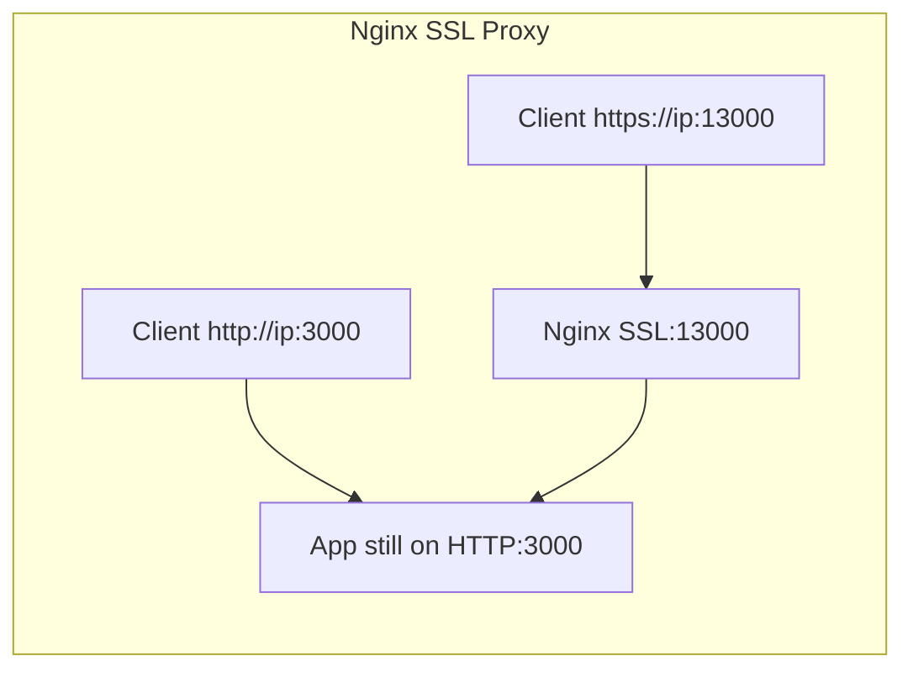
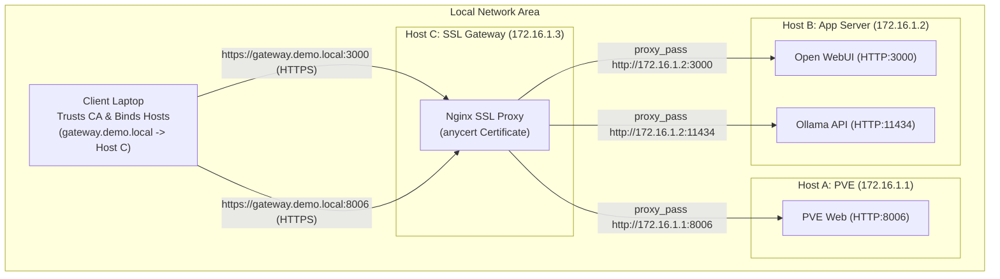
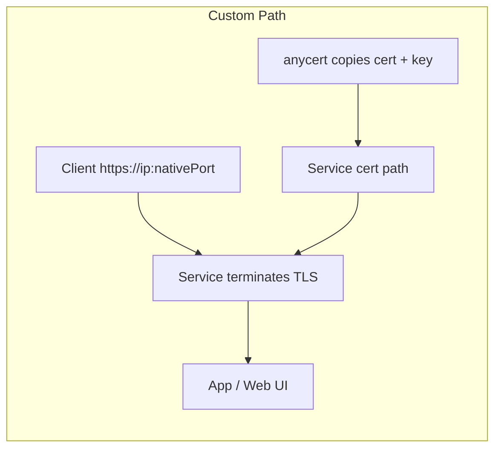
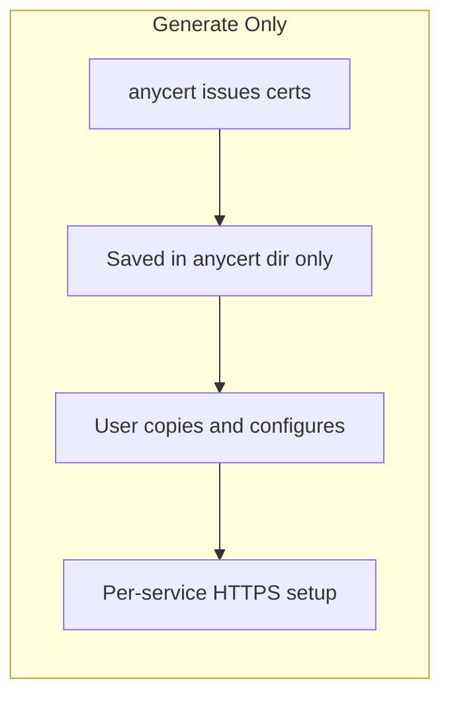
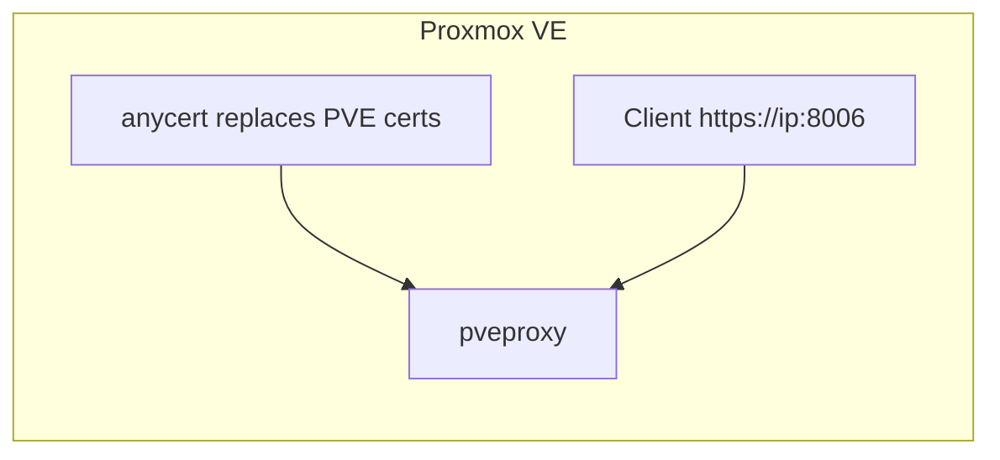

# anycert — Trusted HTTPS for Local Dev, Private Networks, and Enterprise Self-Hosting

anycert is a cross-platform certificate toolkit for private networks, homelabs, and enterprise self-hosted deployments.

It creates your own local CA, issues trusted HTTPS certificates for localhost and internal hosts, and helps you deploy them across Proxmox VE, OpenMediaVault, Unraid, Docker, Nginx, and Node.js services — fully offline, with no public domain required.

**English** | [繁體中文](README_tw.md)

---

## File Description

### Server-side (Generator & Installer)
| File | Platform | Usage |
|------|----------|-------|
| `anycert.sh` | Linux (including WSL) / macOS Server | Generates Root CA + Server cert, supports PVE, Nginx SSL Proxy (Recommended), Custom Paths, and reload commands |
| `anycert.bat` | Windows Server | Generates Root CA + Server cert, supports Nginx SSL Proxy (Recommended), Custom Paths, and reload commands |

### Client-side (Downloader & Truster)
| File | Platform | Usage |
|------|----------|-------|
| `anycert-windows.bat` | Windows Client | Downloads CA cert, updates hosts, imports to Windows Trust Store |
| `anycert-linux.sh` | Linux Client (Ubuntu/Debian) | Downloads CA cert, updates hosts, imports to system and browser (Chrome/Firefox) Trust Stores |
| `anycert-macos.sh` | macOS Client | Downloads CA cert, updates hosts, imports to macOS Keychain |

---

## Why anycert? (Comparison Table)

How does `anycert` compare with other internal TLS/HTTPS solutions?

| Feature | **Ad-hoc Self-Signed (e.g. app-default)** | **Let's Encrypt (DNS-01 / Cloudflare)** | **Tunnels (Cloudflared / ngrok)** | **Mesh VPN (Tailscale HTTPS)** | **anycert (This Script)** |
|---|---|---|---|---|---|
| **Browser Lock 🔒** | ❌ No (Shows red warning / Not Secure) | ✅ Yes | ✅ Yes | ✅ Yes | ✅ Yes (After client setup) |
| **Needs Public Domain** | ✅ No | ❌ Yes | ❌ Yes | ✅ No | ✅ No |
| **Needs Internet** | ✅ No | ❌ Yes | ❌ Must be online | ❌ Must be online | ✅ No — Works 100% offline |
| **Exposes Hostname** | ✅ No | ❌ Yes (CT logs) | ❌ Yes (CT logs) | ✅ No | ✅ No |
| **Isolated LAN Support** | ✅ Yes | ❌ No | ❌ No | ❌ No | ✅ Yes |
| **No Client Reconfig on Renew** | ❌ No (Must re-accept warnings / re-import certs on all clients) | ✅ Yes | ✅ Yes | ✅ Yes | ✅ Yes (Root CA stays trusted) |
| **LAN Data Stays Local** | ✅ Yes | ✅ Yes | ❌ No (Routes via external edge nodes) | ❌ No (Often routes via DERP relays) | ✅ Yes — Full LAN speeds |
| **Client Maintenance & Setup** | ❌ High (Manual exceptions / imports on every client for every renewal) | ✅ None (Browsers natively trust public CA) | ✅ None (Browsers natively trust public CA) | ❌ Medium (Requires installing & running client agent on all devices) | ✅ Low (One-time client script run, no background daemon/agent) |
| **Cost** | Free | Free (Must renew every 3 months) | Free / Paid plans | Free / Paid plans | Free |
| **FQDN Access** | ⚠️ Yes (With red warning) | ✅ Yes | ✅ Yes | ✅ Yes (Limited to `*.ts.net`) | ✅ Yes |
| **IP Access** | ⚠️ Yes (With red warning) | ❌ No | ❌ No | ❌ No | ✅ Yes (SAN contains multiple IPs) |
| **Complexity** | None | High | Medium | Medium | Low (One command server, one command client) |

### Best Use Cases
- **Let's Encrypt + Cloudflare**: Best for homelabs with public domains where you don't mind exposing hostnames to public Certificate Transparency logs.
- **Cloudflared / ngrok**: Good for exposing internal services to the public internet, but poses security risks and fails in offline/LAN environments.
- **Tailscale HTTPS**: Great if your entire fleet is already on Tailscale, but requires an active internet connection to update certificates and forces you to use `*.ts.net` domains.
- **anycert**: Ideal for **fully offline, air-gapped, or secure internal LANs** where no public exposure is wanted, data privacy is critical, and direct IP access is preferred. It supports adding **multiple IP addresses (e.g. physical LAN + Tailscale/VPN virtual IPs)** to the certificate's SAN, making it fully trustable across multiple networks.

---

## 🔒 Why Local HTTPS Matters?

Using HTTPS on a local area network (LAN) provides critical benefits beyond simply **eliminating browser warning screens**:

### 1. Enabling Modern Browser APIs (Secure Contexts Enforcement)
Modern browsers (like Chrome, Safari, Edge) enforce a strict security policy that disables many powerful web APIs unless the page is loaded in a **"Secure Context"** (i.e., over `https://` or on `http://localhost` **only when accessed locally on the server machine**).

If you connect from other devices on the LAN (like your phone, tablet, or another laptop) using plain `http://` with a local IP or custom FQDN, the browser will flag the connection as insecure and **forcefully disable**:
- **Clipboard Operations (Clipboard API)**: This is a major pain point! In local LLM chat applications (e.g., Open WebUI, LLMChat), clicking the **"Copy Code"** button on code blocks will **completely fail** under HTTP cross-device connections.
- **Microphone & Camera Access**: Speech-to-Text inputs and AI voice chat features **cannot access your microphone** if the URL is not HTTPS.
- **PWA Installation (Progressive Web Apps)**: You cannot install local web apps to your desktop or mobile home screen, nor can you use offline features (Service Workers).
- **Hardware Integration**: Gamepad API (game controllers), WebBluetooth, WebUSB, and MIDI keyboard integrations will be disabled.
- **Credential APIs & Passwordless Login (Web Crypto / Passkeys)**: Generating or registering passkeys requires HTTPS.

### 2. Protecting Credentials and Tokens from Local Sniffing
In shared network environments (such as offices, schools, co-living spaces, or public Wi-Fi), unencrypted HTTP traffic can be easily sniffed by anyone on the same network using tools like Wireshark. HTTPS encrypts all communication, preventing:
- Theft of login credentials to your self-hosted services.
- Sniffing of sensitive AI API Keys (such as OpenAI/Anthropic tokens) transmitted to local LLMs.
- Local eavesdropping on private LLM chats and database payloads.

### 3. Preventing Blocked Downloads (Insecure Downloads Policy)
Modern browsers (such as Google Chrome) enforce a strict "Insecure Downloads" policy. If a page is loaded via an insecure connection (plain HTTP), trying to download files (like backups, application logs, AI model weights, or exported files) will trigger a warning. The browser will flag it as an insecure download, block it, and force the user to manually expand settings and select "Keep anyway" to obtain the file. Serving your local tools over HTTPS solves this, allowing downloads to complete smoothly.

---

## 💡 Key Mechanism: 10-Year CA vs. 825-Day Server Cert

**Why is the Root CA valid for 10 years (3650 days), while the server cert is only 825 days?**
Modern operating systems and browsers (like Apple iOS/macOS Safari and Google Chrome) enforce a strict security policy: any leaf SSL/TLS server certificate signed by a private CA must have a maximum validity of **825 days** (approx. 2.2 years). If it exceeds 825 days, the browser will block the connection with an invalid certificate warning.

To bypass this restriction while providing a seamless user experience, `anycert` uses a dual-layer setup:
1. **Root CA (10 years)**: Installed and trusted on the client device. It remains unchanged.
2. **Server Certificate (825 days)**: Installed on the server.
Since the Root CA trusted by your clients remains unchanged, **when the server certificate expires, you only run the script on the server to regenerate it. The clients will automatically trust it without any re-importing or reconfiguration.** This achieves the "configure once, trusted forever" convenience.

---

## 💡 Design Philosophy: Why Port Offsetting instead of Subdomains?

In team environments or local development (**specifically when using Service Profile [1] - Nginx SSL Proxy**), a common question is: "Why not map services to subdomains like `https://app1.demo.local` on port 443, instead of using a single FQDN with different ports (e.g., `:13000`, `:16502`)?"

This is a deliberate design choice to save you and your team from the notorious **"Hosts Modification Hell"**:

| Feature | Option A: Subdomain Routing (Port 443) | Option B: Anycert's Port Offsetting (Shared FQDN) |
| :--- | :--- | :--- |
| **URL Look** | Clean (e.g., `https://llmchat.demo.local`) | Contains port (e.g., `https://server.demo.local:13000`) |
| **Adding a Service** | ❌ **Every developer/client machine must modify their `hosts` file**. Each new web service requires updating `/etc/hosts` on all client PCs, or DNS resolution will fail. | ⚡ **Clients never have to update again**! Because all services share the same FQDN, clients set up hosts once on Day 1, and can immediately connect to any new service on different ports. |
| **Cert Management** | ❌ Requires issuing certificates for each subdomain, or managing complex self-signed Wildcard certs. | 🛡️ Single certificate containing IP SANs. Nginx reloads automatically. Setup overhead is zero. |

**Conclusion: The biggest pain point in self-hosted development environments isn't remembering port numbers—it's updating hosts files on client machines. Anycert's Port Offsetting design is the most practical, zero-maintenance solution for lazy developers.**

---

## Installation Steps

### Step 1 — On the Server (Generate Certs)

#### Linux (including WSL) / macOS Server:
Clone this repo and run `anycert.sh`:
```bash
git clone https://github.com/anomixer/anycert.git
cd anycert
sudo bash anycert.sh
```
The script will:
1. Auto-detect your IP, hostname, and FQDN. You can confirm them and **optionally input additional space-separated IP addresses** (e.g. Tailscale IP, VPN IP, or other LAN IPs) to be included in the certificate's SAN (Subject Alternative Name) and Nginx's `server_name` rules.
2. Let you choose a deployment profile (offers **4 options** on standard servers, and auto-detects Proxmox VE to offer **5 options**):
    - **[1] Auto-Setup Nginx SSL Proxy [Single-Host] [Lazy-Friendly / Recommended]**: Scans listening TCP ports, lets you pick which ones to expose, automatically installs Nginx, and wraps local HTTP ports into HTTPS (`Port + offset` to `HTTP Port`). **The offset defaults to 10000** (e.g. `3000 -> 13000`).
    - **[2] Auto-Setup Nginx SSL Gateway [Dedicated Gateway / Multi-Host]**: Specifically for dedicated Gateway VMs/hosts. Bypasses local port scans, prompts for backend `IP:PORT` mappings, and **defaults to no port offset** (1-to-1 mapping, e.g., HTTPS `3000` proxies to backend `3000`).
    - **[3] Custom Path**: Installs certs to custom target paths and runs a custom service reload command (for services that **already support native HTTPS**).
    - **[4] Generate Only [Painful / Hard Way]**: Just generates the certificates in `/etc/anycert/` for manual setup.
   - **[5] Proxmox VE (PVE)**: *(Only displayed on PVE systems)* Automatically backs up and replaces the default PVE certs, then restarts `pveproxy`.

> 💡 **Tip (Local Browser Access on Server)**
> If you want the browser running on this server itself (e.g. to access local HTTPS wrappers on the server machine) to trust the CA, you do not need to look for server-side imports. You can simply run the client script (`anycert-macos.sh` or `anycert-linux.sh`) locally on this server. Specify `127.0.0.1` as the Server IP and select the local CA import option, and it will configure your hosts, Keychain, and Chrome/Firefox NSS databases automatically!

**Workflow by profile:**

**Profile [1] Nginx SSL Proxy** — Best for plain HTTP services or multi-container setups. Apps keep their HTTP port; HTTPS is served on `Port + offset` (defaults to 10000, customizable):



**Profile [2] Nginx SSL Gateway** — Best for setting up this machine as a dedicated Gateway VM/LXC running only Nginx, which decrypts HTTPS traffic and forwards it to **other servers with different IPs** in the LAN. By default, there is no port offset (1-to-1 mapping, e.g., Nginx listens on HTTPS `3000` and proxies to backend `3000` directly):



> 💡 **Multi-Host Deployment Example:**
> Suppose you have 3 hosts in your local network:
> * **Host A** (IP: `172.16.1.1`): Running PVE (`8006`)
> * **Host B** (IP: `172.16.1.2`): Running Ollama (`11434`) and Open WebUI (`3000`)
> * **Host C** (IP: `172.16.1.3`): A clean VM/host dedicated for **Nginx SSL Gateway**
>
> **Deployment Steps:**
> 1. **Server Setup**: **Only run `anycert.sh` on Host C once**.
>    * Choose Option `[2] Auto-Setup Nginx SSL Gateway [Dedicated Gateway / Multi-Host]`.
>    * Enter the backend list: `172.16.1.1:8006 172.16.1.2:11434 172.16.1.2:3000`.
>    * Keep the port offset at `0` (1-to-1 forwarding).
>    * Nginx on Host C will now automatically listen on HTTPS ports `3000`, `8006`, and `11434` and encrypt-forward them to their backends.
> 2. **Client Setup**: Run the client setup script on your work laptop, and specify **Host C's IP** `172.16.1.3` as the Server IP.
> 3. **Result**: Your laptop can now securely access Open WebUI via `https://gateway.demo.local:3000` and PVE via `https://gateway.demo.local:8006` without warnings. Only Host C needs to manage the SSL certificate!

**Profile [3] Custom Path** — Best when the service **already terminates HTTPS** (OMV, IIS, your own Nginx, etc.). Certs are copied in-place; clients use the **native port**:



**Profile [4] Generate Only** — Issues and saves cert files only; you configure each service manually afterward:



**Profile [5] Proxmox VE (Linux PVE only)** — Automated Custom Path; replaces pveproxy certs directly:



#### Windows Server:
Run Command Prompt (cmd) as **Administrator** and execute:
```cmd
anycert.bat
```
The script will search for OpenSSL (e.g. from Git for Windows), generate the certificates, and allow you to deploy them using the Nginx automatic proxy (automatic download & setup) or to custom paths (e.g. IIS).

> [!NOTE]
> **Windows Nginx Deployment**
> If you choose Nginx SSL Proxy and Nginx is not found locally, the script will automatically download Nginx from the official website and extract it to `C:\nginx\` using Windows native `curl.exe` and `tar.exe`. In isolated or offline network environments, you can manually download the Nginx zip and extract it to `C:\nginx` ensuring `C:\nginx\nginx.exe` exists.

> [!TIP]
> **✨ Smart Configuration & Update Menu**
> If your server already has anycert certificates installed, executing `anycert.sh` or `anycert.bat` again will automatically detect the installation and present an action menu:
> 1. **Update/Modify Nginx Ports**: Change proxy port mappings without regenerating certificates.
>    - **Overwrite Mode**: Enter a space-separated list of ports (e.g. `3000 8080`) to completely overwrite the current ports.
>    - **Adjustment Mode**: Prefix ports with `+` or `-` (e.g. `+8080 -3000`) to incrementally add `8080` and remove `3000` from Nginx proxy wrappers. Nginx configuration will reload automatically.
> 2. **Renew/Regenerate SSL Certificates**: Keeps the existing Nginx proxy ports configuration but renews expired server certificates.
> 3. **Uninstall**: Completely restores the original settings and cleans up certificate directories.

---

### Step 2 — On Each Client (Trust the CA)

Run the script matching your client operating system:

#### Windows Client:
Right-click `anycert-windows.bat` → **Run as Administrator**.
```cmd
anycert-windows.bat
```

#### Linux Client (Ubuntu / Debian):
```bash
sudo bash anycert-linux.sh
```

#### macOS Client:
```bash
sudo bash anycert-macos.sh
```

The client scripts will:
1. Ask for the Server IP and SSH username.
2. **Smart Transmission & CA Download**:
   - **SCP Download**: Attempts to safely copy the Root CA certificate using SCP first.
   - **SMB Fallback (Specifically for Windows Server)**: If the remote server is running Windows and SSH is unavailable (causing SCP to fail), the client script will automatically fall back to the **Windows SMB (Port 445) channel**.
     - *Linux Client*: Automatically checks and installs `smbclient` if missing, then fetches the certificate directly.
     - *macOS Client*: Uses the native `mount_smbfs` system command to cleanly mount the `c$` administrative share and fetch the file.
     - *Smart FQDN Detection*: If SMB connects successfully, it will parse the remote `anycert.conf` directly to extract the FQDN, saving you from entering passwords multiple times or setting up SSH.
   - **Offline / Manual Copy Mode**: If the Windows Server has disabled both SSH and SMB, you can choose `Option 2` (Manual Mode) to manually transfer the `anycert-ca.crt` file using a USB drive, RDP, or other methods. The script will still handle the entire installation process on the client.
3. Detect the server's FQDN and add a mapping to the local `hosts` file.
4. Import the CA certificate to the system trust store (Linux version also automatically handles Chrome and Firefox NSS profiles, macOS handles Keychain).
5. **Print all available HTTPS URLs**: Lists all mapped ports with both FQDN-based and IP-based HTTPS URLs (e.g. `https://mysrv:13000` and `https://192.168.1.100:13000`). This ensures direct access is ready, and provides a quick workaround if your frontend development server (e.g. Vite) blocks hostname access via policies like `allowedHosts`.

---

### Step 3 — Secure HTTPS Connection 🔒
Restart your browser and access your server securely via FQDN or IP:
- `https://<your-server-fqdn>:<port>`
- `https://<your-server-ip>:<port>`

---

## Deployment Examples

### 1. Nginx Automated Reverse Proxy (Service Profile [1] — Auto-Setup Nginx SSL Proxy) (Recommended for single-host multi-service environments)
If you run multiple HTTP services concurrently on the **same machine** (e.g., Ollama, Next.js, Vite, OpenClaw), choose **Service Profile [1] Auto-Setup Nginx SSL Proxy**:
- The script automatically scans active listening TCP ports on the server and lists them as tips.
- Enter the ports you wish to wrap in SSL. Nginx will automatically map them to `HTTPS Port + offset` (defaults to 10000, customizable):
  - `https://mysrv:13000` ➔ proxies to local `http://localhost:3000` (LLMChat / Next.js)
  - `https://mysrv:21434` ➔ proxies to local `http://localhost:11434` (Ollama)
  - `https://mysrv:17860` ➔ proxies to local `http://localhost:7860` (Gradio app)
- **No changes to Docker containers or original app configurations are needed**. Nginx wraps them in TLS seamlessly on the host.

### 2. Nginx SSL Gateway（Service Profile [2] — Auto-Setup Nginx SSL Gateway）(Dedicated Gateway / Multi-Host)
This profile turns your machine into a **dedicated Gateway VM/LXC** (Host N) that decrypts HTTPS traffic and forwards it to **other backend servers with different IPs** across your LAN. There is **no port offset by default** — the Gateway maps HTTPS traffic **1-to-1** to backend ports. Enter the backend `IP:PORT` mappings directly (the script skips local port scanning):

  - `https://gateway.demo.local:8006` ➔ proxies to remote `http://172.16.1.1:8006` (PVE Web on Host A)
  - `https://gateway.demo.local:3000` ➔ proxies to remote `http://172.16.1.2:3000` (Open WebUI on Host B)
  - `https://gateway.demo.local:11434` ➔ proxies to remote `http://172.16.1.2:11434` (Ollama API on Host B)
  - `https://gateway.demo.local:8080` ➔ proxies to remote `http://172.16.1.3:8080` (Home Assistant on Host C)
  - `https://gateway.demo.local:9090` ➔ proxies to remote `http://172.16.1.4:9090` (Prometheus on Host D)
  - `https://gateway.demo.local:8443` ➔ proxies to remote `http://172.16.1.5:8443` (Kubernetes Dashboard on Host E)
  - `https://gateway.demo.local:1880` ➔ proxies to remote `http://172.16.1.6:1880` (Node-RED on Host F)
  - `https://gateway.demo.local:9000` ➔ proxies to remote `http://172.16.1.7:9000` (Portainer on Host G)
- **Backend servers stay on plain HTTP** — only the Gateway holds the SSL certificate. Clients connect to the single Gateway FQDN (`gateway.demo.local`); the Gateway routes to any machine on any port in your LAN. Just add more `IP:PORT` entries as your infrastructure grows.

> 💡 **Multi-Host Deployment Example:**
> Suppose you have a Gateway (Host N) plus many dedicated hosts around your LAN:
> * **Host A** (IP: `172.16.1.1`): Running PVE (`8006`)
> * **Host B** (IP: `172.16.1.2`): Running Ollama (`11434`) and Open WebUI (`3000`)
> * **Host C–G** (IPs `172.16.1.3`–`172.16.1.7`): Various dedicated servers (Home Assistant, Prometheus, etc.)
> * **Host N** (IP: `172.16.1.100`): A clean VM/host dedicated for **Nginx SSL Gateway**
>
> *Only run `anycert.sh` on Host N (172.16.1.100)* — choose Option `[2]`, enter the full backend list (e.g. `172.16.1.1:8006 172.16.1.2:3000 172.16.1.3:8080 ...`) with offset `0`. Then run the client script on your laptop pointing to Host N's IP (`172.16.1.100`). Your laptop can now securely access every service via `https://gateway.demo.local:<port>`.

### 3. OpenMediaVault (OMV)（Service Profile [3] — Custom Path）
OMV uses Nginx to serve its Web UI. Choose Service Profile [3] **Custom Path** and enter:
- Cert target path: `/etc/ssl/certs/openmediavault-webgui.crt`
- Key target path: `/etc/ssl/private/openmediavault-webgui.key`
- Reload command: `systemctl restart nginx`

### 4. Unraid（Service Profile [3] — Custom Path）
Unraid stores its SSL certificate in the USB flash configuration. Choose Service Profile [3] **Custom Path** and enter:
- Cert target path: `/boot/config/ssl/certs/cert.pem`
- Key target path: `/boot/config/ssl/certs/key.pem`
- Reload command: `/etc/rc.d/rc.nginx reload`

### 5. VMware ESXi（Service Profile [3] — Custom Path）
ESXi hosts store their web console certificates in a fixed location. Choose Service Profile [3] **Custom Path** and enter:
- Cert target path: `/etc/vmware/ssl/rui.crt`
- Key target path: `/etc/vmware/ssl/rui.key`
- Reload command: `/etc/init.d/hostd restart && /etc/init.d/vpxa restart`

### 6. Nginx Manual Reverse Proxy (Service Profile [4] — Generate Only) (e.g., local LLM Server / Open WebUI)
You can use Nginx manually as a reverse proxy to add HTTPS to local HTTP services like `http://localhost:3000` (e.g. Open WebUI). Choose Service Profile [4] **Generate Only** to generate the cert files, then manually reference them in your Nginx config:
In your Nginx site config:
```nginx
server {
    listen 443 ssl;
    server_name openwebui.local;
    ssl_certificate /etc/nginx/ssl/anycert.crt;
    ssl_certificate_key /etc/nginx/ssl/anycert.key;

    location / {
        proxy_pass http://127.0.0.1:3000;
        proxy_set_header Host $host;
        proxy_set_header X-Real-IP $remote_addr;
    }
}
```
The corresponding fields are:
- Cert target path: `/etc/nginx/ssl/anycert.crt`
- Key target path: `/etc/nginx/ssl/anycert.key`
- Reload command: `nginx -s reload`

### 7. Proxmox VE（Service Profile [5] — Proxmox VE (PVE)）
If your server is running Proxmox VE, `anycert.sh` will automatically detect the PVE environment and offer an extra **[5] Proxmox VE (PVE)** option in the Service Profile menu. Selecting this option will automatically:
- Back up the existing PVE web proxy certificates (`/etc/pve/local/pveproxy-ssl.pem` and `pveproxy-ssl.key`).
- Overwrite them with the anycert-issued certificate and key.
- Restart the `pveproxy` service to apply changes immediately.

No manual path input or restart command is needed — the script handles the entire PVE web console (`https://<ip>:8006`) HTTPS certificate deployment automatically.

### 8. WSL Deployment（Service Profile [1] — Auto-Setup Nginx SSL Proxy）
If your services (like Nginx or Docker containers) are running inside WSL 2, because WSL 2 is a Linux environment, you should **run the Linux server script directly inside the WSL terminal** instead of running the `.bat` file on the Windows host:
1. Open your WSL terminal (e.g., Ubuntu/Debian) and run:
   ```bash
   sudo bash anycert.sh
   ```
2. When `anycert.sh` prompts you to confirm network configurations:
   - **If you only want to access the WSL service from the local Windows host**: Just accept the default WSL private IP address, and access it via `localhost` or the FQDN.
   - **If you need to access the WSL service from other devices on the LAN**: Manually change the IP address to the **physical LAN IP of your Windows host** (e.g., `192.168.1.100`). This ensures the issued certificate binds to the physical IP. You will then need to configure network routing or port forwarding on the Windows host to forward traffic to WSL.

#### Connecting from Other LAN Devices to WSL 2:
WSL 2 operates on an isolated NAT network by default. To allow other devices on the same physical LAN to access your WSL services, choose one of the following two options:

##### Option A: Configure Port Forwarding via Windows Portproxy (For NAT mode)
Open **PowerShell as Administrator** on your Windows host and run:
```powershell
# 1. Forward SSH Port 22 (for client downloader scripts to fetch certs & configs)
netsh interface portproxy add v4tov4 listenport=22 listenaddress=0.0.0.0 connectport=22 connectaddress=YOUR_WSL_IP

# 2. Forward your HTTPS application Ports (e.g., 16502 and 19999)
netsh interface portproxy add v4tov4 listenport=16502 listenaddress=0.0.0.0 connectport=16502 connectaddress=YOUR_WSL_IP
netsh interface portproxy add v4tov4 listenport=19999 listenaddress=0.0.0.0 connectport=19999 connectaddress=YOUR_WSL_IP

# 3. Allow incoming traffic through Windows Defender Firewall
netsh advfirewall firewall add rule name="WSL SSH Port" dir=in action=allow protocol=TCP localport=22
netsh advfirewall firewall add rule name="WSL HTTPS Ports" dir=in action=allow protocol=TCP localport=16502,19999
```
*Note: Since WSL 2 virtual IP changes upon reboot, you will have to update the `connectaddress` when it changes.*

##### Option B: Enable WSL 2 Mirrored Networking Mode (Easiest, Windows 11 22H2+)
WSL 2 supports sharing the Windows host IP directly, making WSL services listen directly on the physical LAN IP without any portproxy setups.
1. Open Windows Explorer, go to `%userprofile%` (your user folder).
2. Create or edit a file named `.wslconfig` and add:
   ```ini
   [wsl2]
   networkingMode=mirrored
   ```
3. Restart WSL from CMD: `wsl --shutdown` and restart your WSL shell.
4. Allow Ports in Windows Defender Firewall:
   ```cmd
   netsh advfirewall firewall add rule name="WSL Mirrored Ports" dir=in action=allow protocol=TCP localport=22,16502
   ```

> [!NOTE]
> **About Physical Network IP Detection on Windows**
> When running `anycert.bat` on Windows Server, it automatically filters out virtual network interfaces such as Hyper-V Virtual Switch (`vEthernet`), WSL Virtual Switch, Tailscale, VMware, and VirtualBox network adapters. It will automatically detect and bind to the host's actual physical LAN IP address.

---

## Uninstall

### Server-side
```bash
sudo bash anycert.sh -u
# Or Windows Server
anycert.bat -u
```
Removes generated certificates and restores original configurations (including removing Nginx proxies).

### Client-side
```bash
sudo bash anycert-linux.sh -u
# Or macOS Client
sudo bash anycert-macos.sh -u
# Or Windows Client
anycert-windows.bat -u
```
This will display a list of registered servers and allow you to selectively or completely remove the hosts entries and imported CA certificates.
