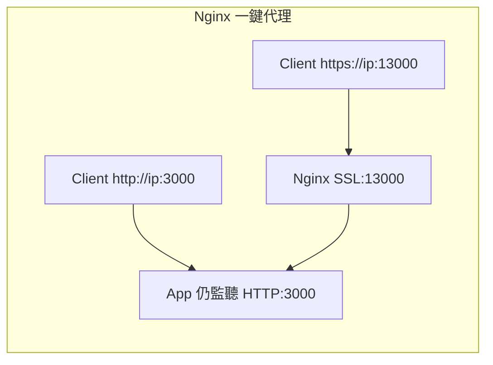
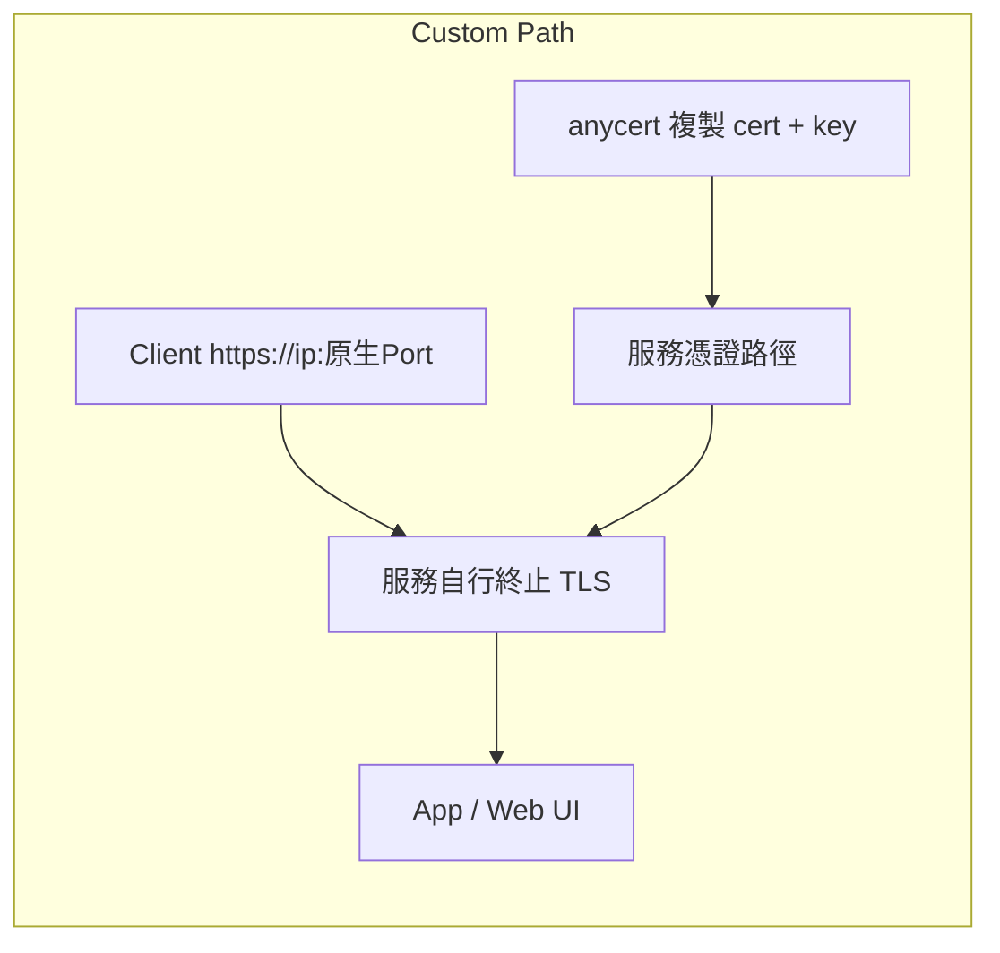
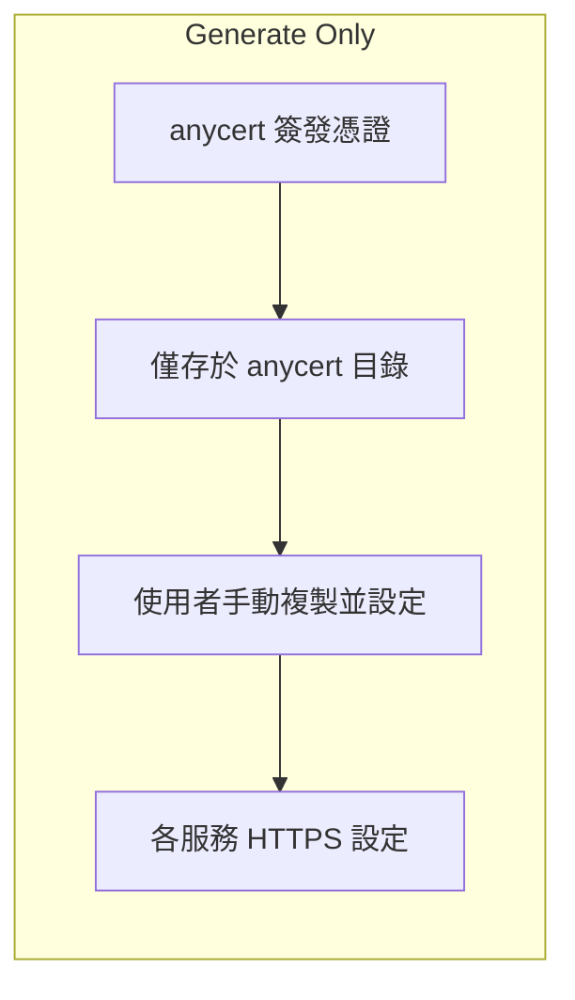
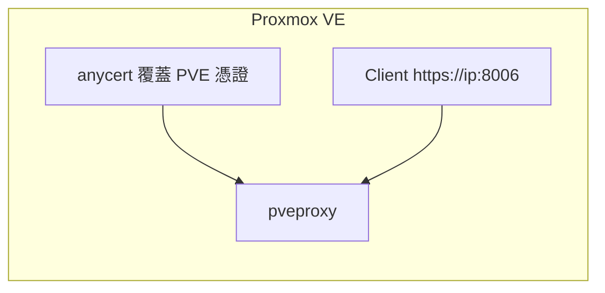

# anycert — 自託管伺服器 HTTPS 憑證管理器，每台用戶端都受信任。

瀏覽器的私有伺服器憑證警告，永久消失。支援 Proxmox VE, OpenMediaVault, Unraid, LLM 伺服器, Nginx 等任何自託管伺服器。

伺服器一個指令，每台用戶端一個指令 — 瀏覽器顯示鎖頭，十年內持續有效，完全離線運作，不需要任何公開網域。

[English](README.md) | **繁體中文**

---

## 檔案說明

### 伺服器端 (產證與套用)
| 檔案 | 平台 | 用途 |
|------|------|------|
| `anycert.sh` | Linux (含 WSL) / macOS 伺服器 | 產生 Root CA + 伺服器憑證，支援 PVE、Nginx 反代一鍵代理 (推薦)、自訂路徑套用與服務重啟 |
| `anycert.bat` | Windows 伺服器 | 產生 Root CA + 伺服器憑證，支援 Nginx 反代一鍵代理 (推薦)、自訂路徑套用與指令重啟 |

### 用戶端 (下載與信任)
| 檔案 | 平台 | 用途 |
|------|------|------|
| `anycert-windows.bat` | Windows 用戶端 | 下載 CA 憑證、更新 hosts、匯入 Windows 信任存放區 |
| `anycert-linux.sh` | Linux 用戶端 (Ubuntu/Debian) | 下載 CA 憑證、更新 hosts、匯入系統與瀏覽器 (Chrome/Firefox) 信任存放區 |
| `anycert-macos.sh` | macOS 用戶端 | 下載 CA 憑證、更新 hosts、匯入 macOS Keychain |

---

## 為什麼要用 anycert？（方案比較表）

處理自託管內網 Web UI 的 TLS 憑證有幾種常見方式，下表詳細比較各方法的差異。

| 特性 | **一般自簽憑證 (如 PVE 預設或手動產生的單一憑證)** | **Let's Encrypt (DNS-01 / Cloudflare)** | **Tunnel 服務 (Cloudflared / ngrok)** | **Mesh VPN (Tailscale HTTPS)** | **anycert (本腳本)** |
|---|---|---|---|---|---|
| **瀏覽器鎖頭 🔒** | ❌ 無 (持續顯示紅色警告/不安全) | ✅ 有 | ✅ 有 | ✅ 有 | ✅ 有（完成用戶端設定後） |
| **需要公開網域** | ✅ 否 | ❌ 是 | ❌ 是 | ✅ 否 | ✅ 否 |
| **需要網際網路連線** | ✅ 否 | ❌ 是 | ❌ 必須連網 | ❌ 必須連網 | ✅ 否 — 完全離線可用 |
| **主機名稱公開曝露** | ✅ 否 | ❌ 是 (CT logs) | ❌ 是 (CT logs) | ✅ 否 | ✅ 否 |
| **可在隔離 LAN 使用** | ✅ 是 | ❌ 否 | ❌ 否 | ❌ 否 | ✅ 是 |
| **憑證更新免重設用戶端** | ❌ 否 (每次更新伺服器憑證，所有用戶端皆須重新按例外警告或手動重載) | ✅ 是 | ✅ 是 | ✅ 是 | ✅ 是 (Root CA 十年保持受信任) |
| **資料不繞經外網** | ✅ 是 | ✅ 是 | ❌ 否 (繞經外部邊緣節點) | ❌ 否 (通常需要打洞或繞經中繼伺服器) | ✅ 是 — 純區域網路速度 |
| **用戶端設定與維護成本** | ❌ 高 (每台裝置每次憑證到期更新，都必須重新接受警告或重新匯入) | ✅ 免設定 (瀏覽器原生信任公網 CA) | ✅ 免設定 (瀏覽器原生信任公網 CA) | ❌ 中 (每台連線裝置都必須下載、登入並常駐執行 Tailscale 軟體) | ✅ 低 (每台裝置僅需執行一次性腳本，不需常駐程式/不佔系統資源) |
| **費用** | 免費 | 免費 (每 3 個月需重簽) | 免費 / 部分付費 | 免費 / 企業收費 | 免費 |
| **以 FQDN 存取** | ⚠️ 可 (但顯示不安全/紅色警告) | ✅ 是 | ✅ 是 | ✅ 是 (限 `*.ts.net`) | ✅ 是 |
| **以 IP 存取** | ⚠️ 可 (但顯示不安全/紅色警告) | ❌ 否 | ❌ 否 | ❌ 否 | ✅ 是 (SAN 包含多個 IP) |
| **設定複雜度** | 無 | 中高 | 中 | 中 | 低 (伺服器一個指令，用戶端一個指令) |

### 各方法適用情境
- **Let's Encrypt + Cloudflare**：適合家裡有公開網域，且不介意主機名稱暴露在 Certificate Transparency Logs 中的 Homelab 用戶。
- **Cloudflared / ngrok**：適合需要從外網存取內網服務的人，但有隱私安全疑慮，且無法在離線/無網網路下運作。
- **Tailscale HTTPS**：適合已經全站部署 Tailscale 的環境，但必須連網更新憑證，且所有用戶端都必須加入同一個 Tailnet。
- **anycert**：推薦用於任何**無公開網域、處於內網隔離環境、或不希望服務暴露至外網**的自託管基礎設施。其核心優勢是**完全離線**、**資料安全不經外網**，且**支援直接以 IP 存取**。此外，它支援在憑證的 SAN 中**綁定多個 IP（例如實體區域網路 IP + Tailscale/VPN 虛擬 IP）**，讓您的自託管服務能在多套網路架構中都順暢取得綠色鎖頭信任。

---

## 🔒 為什麼內網也需要 HTTPS？

在區域網路 (LAN) 中使用 HTTPS，除了**消除瀏覽器紅色不安全警告**外，還有以下幾個非常關鍵的技術與實務原因：

### 1. 啟用現代瀏覽器的進階功能 (Secure Contexts 限制)
現代瀏覽器（如 Chrome, Safari, Edge）基於隱私安全防護，規定許多強大的 Web API 僅能在**「安全上下文 (Secure Contexts)」**中執行（即 `https://` 網址，或是**僅限在伺服器本機上存取時的 `http://localhost`**）。

若您從區域網路內的其他裝置（例如您的手機、平板或其他筆電）使用普通的 `http://` 加上內網 IP 或自訂 FQDN 連線，瀏覽器會判定為不安全環境，並**強行禁用**以下功能：
- **剪貼簿操作 (Clipboard API)**：這是最常見的痛點！在 AI 聊天室（如 Open WebUI, LLMChat）中，如果使用 HTTP 跨裝置連線，點擊「複製程式碼塊 (Copy Code)」按鈕將會**直接失效**。
- **麥克風與相機 (Microphone & Camera)**：若您使用語音對話 AI（Speech-to-Text），非 HTTPS 網址瀏覽器將**無法存取您的麥克風進行收音**。
- **PWA 應用安裝 (Progressive Web Apps)**：無法將網頁服務安裝到桌面或手機主畫面，也無法使用背景推送與快取 (Service Workers)。
- **外部硬體支援**：包括藍牙 (WebBluetooth)、USB 裝置 (WebUSB)、MIDI 鍵盤、搖桿 (Gamepad API) 等硬體互動。
- **安全憑證與無密碼登入 (Web Crypto / Passkeys)**：無法在該網頁上註冊金鑰。

### 2. 防止區域網路內的密碼與 Token 被竊聽
在公司、學校、共享出租套房、或公共 Wi-Fi 等區域網路環境中，未經加密的 HTTP 流量很容易被同網路的其他人使用網路嗅探工具（如 Wireshark）側錄。HTTPS 能將所有傳輸加密，防止：
- 您的自託管服務登入密碼外洩。
- 傳輸的 AI API Keys (如 OpenAI/Claude Tokens) 被竊取。
- LLM 聊天隱私與資料庫內容被中途監聽。

### 3. 防止檔案下載被瀏覽器標示為不安全而封鎖 (Insecure Downloads Policy)
現代瀏覽器（例如 Google Chrome）對普通 HTTP 連線有嚴格的「不安全下載」防護機制。當您在 HTTP 環境下從自託管服務下載檔案（如系統備份檔、應用程式 Log、AI 模型權重檔或匯出報表）時，瀏覽器會主動將其判定為風險下載並直接攔截封鎖，迫使使用者必須展開下載清單，在多層警告中手動點選「仍要保留」才能存取檔案。使用 HTTPS 可以讓本地下載完全信任，流暢完成存檔。

---

## 💡 關鍵機制：10 年 CA 與 825 天憑證

**為什麼 Root CA 有效期是 10 年（3650 天），而伺服器憑證只有 825 天？**
現代瀏覽器與作業系統（例如 Apple iOS/macOS Safari 與 Google Chrome）基於安全政策，規定私有 CA 簽發的 SSL/TLS 伺服器憑證（分葉憑證）最長有效期不能超過 **825 天**（約 2.2 年）。若設定超過這個天數，瀏覽器會直接拒絕連線並顯示錯誤。

因此 `anycert` 採用雙層架構：
1. **Root CA (10年)**：寫入用戶端信任存取區。10 年之內完全不需要變更。
2. **伺服器憑證 (825天)**：安裝在您的自託管伺服器上。
由於 Root CA 在這 10 年內不變，**當伺服器憑證到期時，您只需在伺服器端重新跑一次腳本更新伺服器憑證，所有用戶端完全無感，不需要進行任何重新匯入或設定**。這實現了「一次設定，終身免重設」的最佳體驗。

---

## 安裝步驟

### 步驟一 — 在伺服器端執行 (產生憑證)

#### Linux (含 WSL) / macOS 伺服器：
在伺服器上 clone 此 repo 並執行 `anycert.sh`：
```bash
git clone https://github.com/anomixer/anycert.git
cd anycert
sudo bash anycert.sh
```
腳本將會：
1. 自動偵測 IP、主機名稱與 FQDN。您可以確認並**選擇性輸入額外的 IP 位址（以空白分隔）**，例如 Tailscale IP、VPN IP 或其他實體網路 IP，以一併寫入憑證的 SAN（主機別名）以及 Nginx 的 `server_name` 配置中。
2. 提供服務部署設定檔 (Service Profile) 選擇（一般伺服器提供 **3 個**選項，若在 Proxmox VE 系統則會自動多出 PVE 專屬選項共 **4 個**）：
    - **Auto-Setup Nginx SSL Proxy [Lazy-Friendly / Recommended] (一鍵代理模式)**：自動偵測伺服器目前正在監聽的 TCP Ports，引導您選擇要對外開通的服務，一鍵幫您裝好 Nginx，並建立 `HTTPS Port + 偏移量` 到 `HTTP Port` 的反向代理封裝（**偏移量預設為 10000，可自行設定**，如 `+1` / `+10` / `+443`，例如 `3000 → 13000`）。
   - **Proxmox VE (PVE)**：*（僅在 PVE 系統執行時顯示）* 自動備份並覆蓋 PVE 預設憑證，並重啟 `pveproxy`。
   - **Custom Path**：自訂憑證與金鑰複製目標路徑，並可設定自訂的重啟/重載服務指令（適用於已有現成 HTTPS 服務的環境）。
   - **Generate Only [Painful / Hard Way]**：僅產生檔案於 `/etc/anycert/` 中，供手動套用。

**各模式流量示意：**

**Nginx 一鍵代理** — 適合純 HTTP 服務、多容器並存；App 維持原 HTTP Port，HTTPS 走 `Port + 偏移量`（預設 10000，可自訂）：



**Custom Path** — 適合服務**本身已支援 HTTPS**（OMV、IIS、自架 Nginx 等）；憑證打入服務路徑後，以**原生 Port** 提供 HTTPS：



**Generate Only** — 只簽發並存檔，不自動部署；後續由使用者自行套用至各服務：



**Proxmox VE（僅 Linux PVE 顯示）** — 等同自動化的 Custom Path，直接覆蓋 `pveproxy` 憑證：



#### Windows 伺服器：
以**系統管理員身分**執行命令提示字元 (cmd) 並執行：
```cmd
anycert.bat
```
腳本將會搜尋系統中的 OpenSSL（例如 Git for Windows 內建的 OpenSSL），簽發憑證後，提供與 Linux 完全一致的 Nginx 一鍵代理功能（自動下載 Nginx 設定並啟動），或允許您將憑證部署到自訂路徑（如 IIS）。

> [!NOTE]
> **Windows 下的 Nginx 部署**
> 若您選擇「一鍵 Nginx 代理」且本機未安裝 Nginx，腳本會透過 Windows 原生 `curl.exe` 與 `tar.exe` 自動從 Nginx 官網下載並解壓縮至 `C:\nginx\`。若在隔離/離線內網環境中，您也可以手動下載 Nginx zip 並解壓至該資料夾，確保 `C:\nginx\nginx.exe` 存在即可。

> [!TIP]
> **✨ 智慧設定更新選單**
> 若您的伺服器已經安裝過 anycert 憑證，再次執行 `anycert.sh` 或 `anycert.bat` 時，系統會自動辨識並跳出選擇選單：
> 1. **更新/修改 Nginx Port 對應**：不需要重新簽發憑證，可以直接輸入新的 Port。
>    - **覆蓋模式**：直接輸入連接埠（如 `3000 8080`），將完全取代現有配置。
>    - **增量/減量微調**：使用 `+` 或 `-` 作為首字元（如 `+8080 -3000`），即可無痛增加 `8080` 埠並刪除 `3000` 埠代理，自動重載 Nginx 生效。
> 2. **重新產生/更新 SSL 憑證**：保留目前的 Port 代理設定，重新簽發過期的伺服器憑證。
> 3. **完整解除安裝並還原設定**。

---

### 步驟二 — 在每台用戶端執行 (信任 CA)

依用戶端的作業系統，在用戶端機器執行對應的腳本：

#### Windows 用戶端：
右鍵點擊 `anycert-windows.bat` → **以系統管理員身分執行**。
```cmd
anycert-windows.bat
```

#### Linux 用戶端 (Ubuntu / Debian)：
```bash
sudo bash anycert-linux.sh
```

#### macOS 用戶端：
```bash
sudo bash anycert-macos.sh
```

這些腳本會：
1. 提示輸入伺服器 IP 與 SSH 使用者名稱。
2. **智慧傳輸與下載 Root CA**：
   - **SCP 下載**：優先使用 scp 進行安全複製。
   - **SMB 備用通道 (特別針對 Windows 伺服器)**：若遠端伺服器為 Windows 且未開通 SSH 服務（導致 SCP 失敗），用戶端腳本會自動改走 **Windows SMB (Port 445) 管道**。
     - *Linux 用戶端*：自動檢查並引導安裝 `smbclient`，直接拉取憑證。
     - *macOS 用戶端*：使用內建 `mount_smbfs` 機制無痕掛載 `c$` 共用區拉取。
     - *智慧 FQDN 讀取*：若使用 SMB 連線成功，將直接解析 remote 的 `anycert.conf` 取得 FQDN，完全免除 SSH 連線或密碼手動重複輸入。
   - **離線手動複製模式 (Offline / Manual Mode)**：若 Windows Server 既無 SSH 也無 SMB，您可選擇 `Option 2`（Manual Mode），手動以隨身碟、RDP 或其他方式拷貝 CA 憑證至本機，腳本仍會為您自動執行後續所有的信任區與 hosts 安裝設定！
3. **FQDN 自動對應**：自動將 FQDN 寫入用戶端的 `hosts` 檔案中。
4. **系統與瀏覽器信任**：將 CA 憑證匯入系統信任區（Linux 版會同時自動匯入 Chrome 與 Firefox 的 NSS 憑證資料庫，macOS 版匯入 Keychain）。
5. **列出所有可用 HTTPS URLs**：對於所有設定的反向代理連接埠，腳本會同時列出 FQDN 版本與 IP 版本的 HTTPS 網址（例如 `https://mysrv:13000` 與 `https://192.168.1.100:13000`）。這能提供即時的連線選擇，並且當您的前端開發伺服器（例如 Vite）透過 `allowedHosts` 政策阻擋 Hostname 存取時，可作為快速的備用 IP 連線選項。

---

### 步驟三 — 享受 HTTPS 🔒
重啟瀏覽器，您就可以透過 FQDN 或 IP 網址安全連線了：
- `https://<your-server-fqdn>:<port>`
- `https://<your-server-ip>:<port>`

---

## 部署範例 (自定義服務套用)

### 1. Nginx 一鍵反向代理 (適用於多容器 / 多服務並存，最懶人推薦)
若您在伺服器上同時跑了多個 HTTP 服務（例如：Ollama、Next.js、Vite、vLLM、OpenClaw 等），直接選擇 **Option 2 (Auto-Setup Nginx SSL Proxy)**：
- 程式會掃描目前本機監聽的 TCP 連接埠（例如您目前正在運行的 `3000`、`5173` 等服務埠）並印出 [TIP] 提示。
- 輸入您要以 SSL 封裝的連接埠，Nginx 就會自動監聽對應的 `安全埠 (原本連接埠 + 偏移量，預設 10000，可自訂)`：
  - `https://mysrv:13000` ➔ 轉發至本地 `http://localhost:3000` (Next.js app / LLMChat)
  - `https://mysrv:15173` ➔ 轉發至本地 `http://localhost:5173` (Vite apps)
  - `https://mysrv:17860` ➔ 轉發至本地 `http://localhost:7860` (Gradio apps)
  - `https://mysrv:18000` ➔ 轉發至本地 `http://localhost:8000` (vLLM)
  - `https://mysrv:18081` ➔ 轉發至本地 `http://localhost:8081` (MongoDB Web UI)
  - `https://mysrv:19119` ➔ 轉發至本地 `http://localhost:9119` (hermes-agent)
  - `https://mysrv:21434` ➔ 轉發至本地 `http://localhost:11434` (Ollama)
  - `https://mysrv:28789` ➔ 轉發至本地 `http://localhost:18789` (OpenClaw)
- 您**完全不需修改任何 Docker 容器或程式碼設定**，也無須在容器內啟用 HTTPS，全交給本機 Host 端 Nginx 在外層套上 SSL 憑證防護。

### 2. OpenMediaVault (OMV)
OMV 預設的 nginx 憑證路徑通常位於 `/etc/ssl/certs/`，您可以將其覆蓋（Option 1）：
- 憑證目標路徑: `/etc/ssl/certs/openmediavault-webgui.crt`
- 金鑰目標路徑: `/etc/ssl/private/openmediavault-webgui.key`
- 重啟指令: `systemctl restart nginx`

### 3. Unraid
Unraid 的 SSL 憑證位於 USB 隨身碟掛載路徑：
- 憑證目標路徑: `/boot/config/ssl/certs/cert.pem`
- 金鑰目標路徑: `/boot/config/ssl/certs/key.pem`
- 重啟指令: `/etc/rc.d/rc.nginx reload`

### 4. VMware ESXi
ESXi 的 Web 控制台憑證存放於主機的固定路徑中，覆蓋即可（Option 1）：
- 憑證目標路徑: `/etc/vmware/ssl/rui.crt`
- 金鑰目標路徑: `/etc/vmware/ssl/rui.key`
- 重啟指令: `/etc/init.d/hostd restart && /etc/init.d/vpxa restart`

### 5. Nginx 手動反向代理 (如各類 LLM 伺服器 / Open WebUI)
您可以透過 Nginx 反向代理，為 `http://localhost:3000` (Open WebUI) 加上 HTTPS。
在 Nginx 設定檔中：
```nginx
server {
    listen 443 ssl;
    server_name openwebui.local;
    ssl_certificate /etc/nginx/ssl/anycert.crt;
    ssl_certificate_key /etc/nginx/ssl/anycert.key;

    location / {
        proxy_pass http://127.0.0.1:3000;
        proxy_set_header Host $host;
        proxy_set_header X-Real-IP $remote_addr;
    }
}
```
執行 `anycert.sh` 時輸入：
- 憑證目標路徑: `/etc/nginx/ssl/anycert.crt`
- 金鑰目標路徑: `/etc/nginx/ssl/anycert.key`
- 重啟指令: `nginx -s reload`

### 6. WSL (Windows Subsystem for Linux) 部署指引
如果您的服務（如 Nginx, Docker 容器等）架設在 WSL 2 中，因為 WSL 2 是 Linux 系統，您應該**直接在 WSL 終端機內執行 Linux 伺服器指令**，而不是在 Windows 宿主機執行 `.bat`：
1. 開啟您的 WSL 終端機 (如 Ubuntu/Debian)，直接執行：
   ```bash
   sudo bash anycert.sh
   ```
2. 當 `anycert.sh` 偵測網路資訊並提示確認時：
   - **如果僅在 Windows 本機瀏覽器存取 WSL 服務**：直接沿用偵測到的 WSL 內部虛擬 IP 即可，並可直接透過 `localhost` 或 FQDN 存取。
   - **如果需要開放區網內其他裝置連線至 WSL 服務**：請手動將 IP 修改輸入為 **Windows 宿主機的實體區網 IP**。這樣簽發出的憑證才會包含該實體 IP。隨後只需在 Windows 宿主機使用 `netsh` 設定埠號轉發（Port Forwarding）將流量轉入 WSL 即可。

> [!NOTE]
> **關於 Windows 的實體網卡 IP 偵測**
> 在 Windows 伺服器端執行 `anycert.bat` 時，系統已內建智慧過濾。會自動排除 Hyper-V 虛擬網卡 (`vEthernet`)、WSL 虛擬交換機、Tailscale 以及 VMware/VirtualBox 等虛擬網路介面，精準自動取得本機實體的實體 LAN IP。

---

## 解除安裝

### 伺服器端
```bash
sudo bash anycert.sh -u
# 或 Windows
anycert.bat -u
```
會將所有備份還原，並清理產生的憑證。

### 用戶端
```bash
sudo bash anycert-linux.sh -u
# 或 macOS
sudo bash anycert-macos.sh -u
# 或 Windows
anycert-windows.bat -u
```
會提供已註冊網站列表，允許您單個或全部刪除 hosts 項目與匯入的 Root CA 信任。
