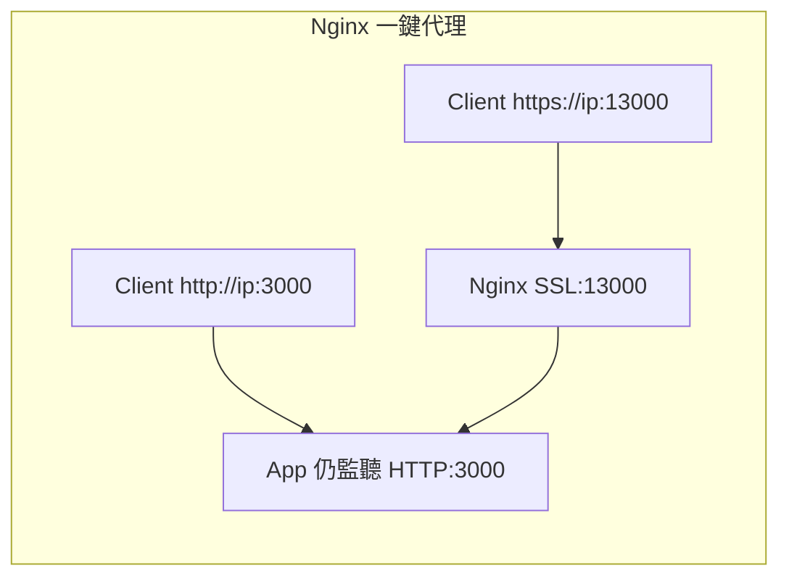
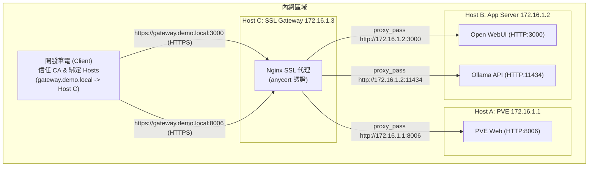
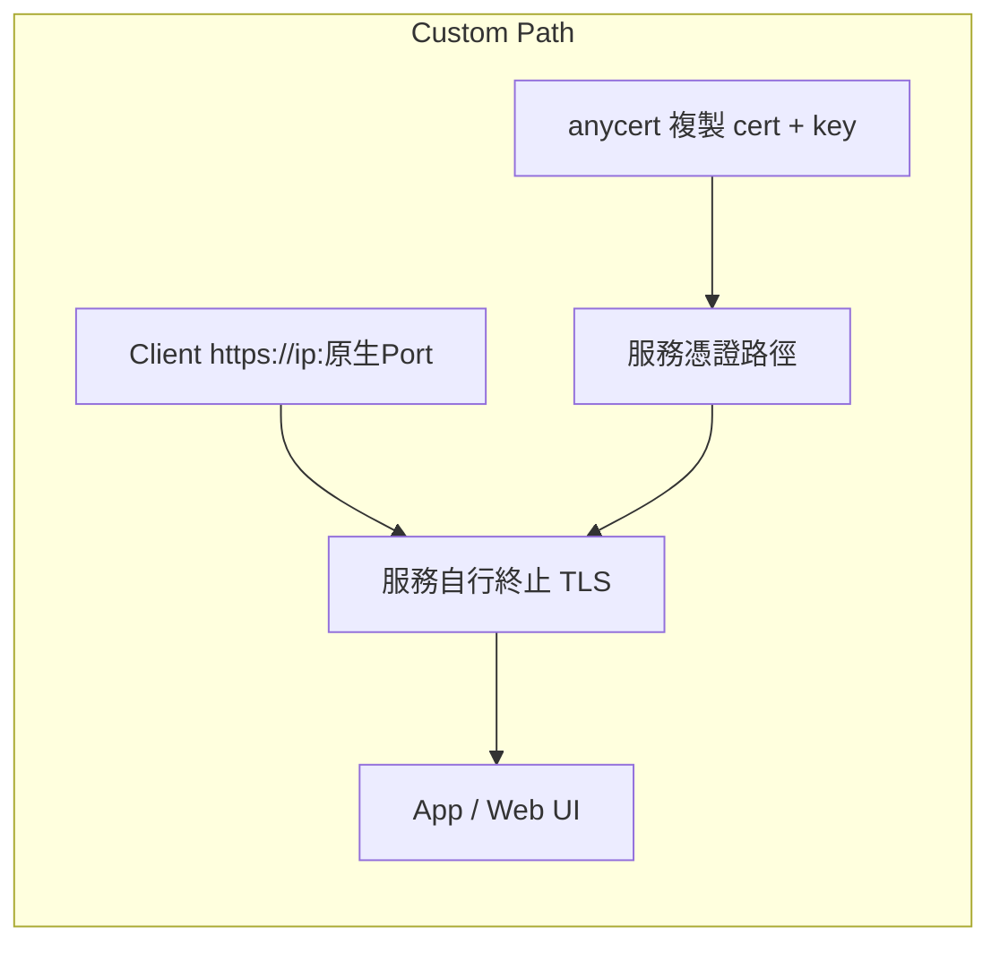
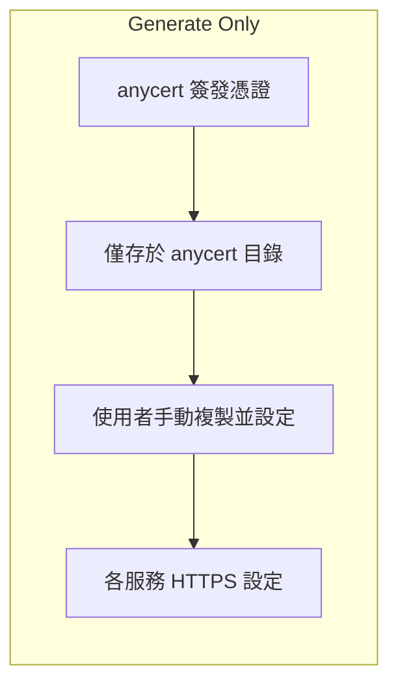
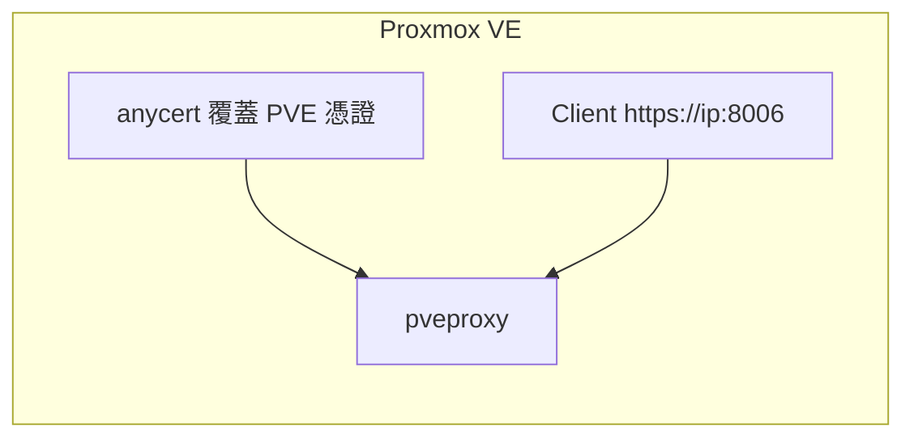

# anycert — 本機開發、私有網路與企業自架服務的受信 HTTPS 工具

anycert 是一套跨平台憑證工具，適用於私有網路、homelab，以及企業自架部署。

它會建立你自己的本機 CA，為 localhost 與內部主機簽發受信任的 HTTPS 憑證，並協助你部署到 Proxmox VE、OpenMediaVault、Unraid、Docker、Nginx 與 Node.js 服務上——全程離線，不需要公開網域。

[English](README.md) | **繁體中文**

---

## 快速開始

**伺服器端**（產生並部署憑證與 Nginx 首頁）：
```bash
git clone https://github.com/anomixer/anycert.git
cd anycert
sudo bash anycert.sh  # Windows 伺服器：以系統管理員執行 anycert.bat
```

**每台用戶端**（信任 CA — 推薦選項 A）：
- **Option A (首選⭐ 網頁一鍵下載)**：用瀏覽器開啟 `http://<SERVER_IP>/`，直接在 AnyCert 首頁點擊下載並執行對應平台的安裝腳本！
- **Option B (命令列/CLI)**：
  ```bash
  # Windows：右鍵 anycert-windows.bat → 以系統管理員身分執行
  # Linux：
  sudo bash anycert-linux.sh
  # macOS：
  sudo bash anycert-macos.sh
  ```

**完成。** 直接以 `https://<your-fqdn>:<port>` 或 `https://<your-ip>:<port>` 安全存取您的伺服器。

---

## 為什麼要用 anycert？

處理自託管內網 Web UI 的 TLS 憑證有幾種常見方式，下表詳細比較各方法的差異。

| 特性 | **一般自簽憑證 (如 PVE 預設或手動產生的單一憑證)** | **Let's Encrypt (DNS-01 / Cloudflare)** | **Tunnel 服務 (Cloudflared / ngrok)** | **Mesh VPN (Tailscale HTTPS)** | **anycert (本腳本)** |
|---|---|---|---|---|---|
| **瀏覽器鎖頭 🔒** | ❌ 無 (持續顯示紅色警告/不安全) | ✅ 有 | ✅ 有 | ✅ 有 | ✅ 有（完成用戶端設定後） |
| **需要公開網域** | ✅ 否 | ❌ 是 | ❌ 是 | ✅ 否 | ✅ 否 |
| **需要網際網路連線** | ✅ 否 | ❌ 是 | ❌ 必須連網 | ❌ 必須連網 | ✅ 否 — 完全離線可用 |
| **主機名稱公開曝露** | ✅ 否 | ❌ 是 (CT logs) | ❌ 是 (CT logs) | ✅ 否 | ✅ 否 |
| **可在隔離 LAN 使用** | ✅ 是 | ❌ 否 | ❌ 否 | ❌ 否 | ✅ 是 |
| **憑證更新免重設用戶端** | ❌ 否 (每次更新伺服器憑證，所有用戶端皆須重新按例外警告或手動重載) | ✅ 是 | ✅ 是 | ✅ 是 | ✅ 是 (Root CA 十年保持受信任) |
| **資料不繞經外網** | ✅ 是 | ✅ 是 | ❌ 否 (繞經外部邊緣節點) | ❌ 否 (通常需要打洞或繞經中繼伺服器) | ✅ 是 — 純區域網路速度 |
| **用戶端設定與維護成本** | ❌ 高 (每台裝置每次憑證到期更新，都必須重新接受警告或重新匯入) | ✅ 免設定 (瀏覽器原生信任公網 CA) | ✅ 免設定 (瀏覽器原生信任公網 CA) | ❌ 中 (每台連線裝置都必須下載、登入並常駐執行 Tailscale 軟體) | ✅ 低 (每台裝置僅需執行一次性腳本，不需常駐程式/不佔系統資源) |
| **費用** | 免費 | 免費 (每 3 個月需重簽) | 免費 / 部分付費 | 免費 / 企業收費 | 免費 |
| **以 FQDN 存取** | ⚠️ 可 (但顯示不安全/紅色警告) | ✅ 是 | ✅ 是 | ✅ 是 (限 `*.ts.net`) | ✅ 是 |
| **以 IP 存取** | ⚠️ 可 (但顯示不安全/紅色警告) | ❌ 否 | ❌ 否 | ❌ 否 | ✅ 是 (SAN 包含多個 IP) |
| **設定複雜度** | 無 | 中高 | 中 | 中 | 低 (伺服器一個指令，用戶端一個指令) |

### 各方法適用情境
- **Let's Encrypt + Cloudflare**：適合家裡有公開網域，且不介意主機名稱暴露在 Certificate Transparency Logs 中的 Homelab 用戶。
- **Cloudflared / ngrok**：適合需要從外網存取內網服務的人，但有隱私安全疑慮，且無法在離線/無網網路下運作。
- **Tailscale HTTPS**：適合已經全站部署 Tailscale 的環境，但必須連網更新憑證，且所有用戶端都必須加入同一個 Tailnet。
- **anycert**：推薦用於任何**無公開網域、處於內網隔離環境、或不希望服務暴露至外網**的自託管基礎設施。其核心優勢是**完全離線**、**資料安全不經外網**，且**支援直接以 IP 存取**。此外，它支援在憑證的 SAN 中**綁定多個 IP（例如實體區域網路 IP + Tailscale/VPN 虛擬 IP）**，讓您的自託管服務能在多套網路架構中都順暢取得綠色鎖頭信任。

---

### anycert vs. mkcert

[mkcert](https://github.com/FiloSottile/mkcert) 是廣受開發者歡迎的本機開發 HTTPS 憑證工具。anycert 涵蓋相同的使用情境，並在此基礎上提供更多功能。以下是兩者的詳細比較：

| 功能 | **[mkcert](https://github.com/FiloSottile/mkcert)** | **anycert Profile [4] 僅產生憑證** | **anycert Profile [3] 自訂路徑** | **anycert Profile [1] Nginx SSL 代理** |
|---|---|---|---|---|
| **本機開發 HTTPS (localhost)** | ✅ 是 | ✅ 是 | ✅ 是 | ✅ 是 |
| **LAN / IP SAN 支援** | ✅ 是 | ✅ 是 | ✅ 是 | ✅ 是 |
| **安裝 CA 至系統信任區** | ✅ 自動 | ✅ 自動（搭配用戶端腳本） | ✅ 自動（搭配用戶端腳本） | ✅ 自動（伺服器端） |
| **安裝 CA 至 Firefox / Chrome NSS** | ✅ 是 | ✅ 是（透過用戶端腳本） | ✅ 是（透過用戶端腳本） | ✅ 是（透過用戶端腳本） |
| **自動複製憑證至服務路徑** | ❌ 手動 | ❌ 手動 | ✅ 自動 | ✅ 自動（Nginx） |
| **部署後自動重載服務** | ❌ 否 | ❌ 否 | ✅ 可設定 | ✅ 是（Nginx reload） |
| **自動安裝反向代理（Nginx）** | ❌ 否 | ❌ 否 | ❌ 否 | ✅ 是 |
| **LAN 多裝置 CA 自動分發** | ❌ 手動（需自行複製 rootCA.pem） | ✅ 用戶端腳本自動下載並匯入 | ✅ 用戶端腳本自動下載並匯入 | ✅ 用戶端腳本自動下載並匯入 |
| **用戶端 hosts 自動寫入** | ❌ 手動 | ✅ 自動（用戶端腳本） | ✅ 自動（用戶端腳本） | ✅ 自動（用戶端腳本） |
| **需要安裝執行檔 (binary)** | ⚠️ 是（Go 編譯 OR 預先編譯的 binary） | ✅ 否（純 shell/bat） | ✅ 否（純 shell/bat） | ✅ 否（純 shell/bat） |
| **Windows 支援** | ✅ 是 | ✅ 是 | ✅ 是 | ✅ 是 |
| **macOS 支援** | ✅ 是 | ✅ 是 | ✅ 是 | ✅ 是 |
| **Linux 支援** | ✅ 是 | ✅ 是 | ✅ 是 | ✅ 是 |

**簡而言之：** anycert **Profile [4] 僅產生憑證** 是最接近 mkcert 的對應模式——兩者都只是產生受信任的憑證，服務設定由使用者自行完成。**Profile [3] 自訂路徑** 更進一步，可自動將憑證複製至指定服務目錄並重載服務。**Profile [1] Nginx SSL 代理** 則是 mkcert 完全沒有的完整方案——自動將您現有的 HTTP 服務包上 HTTPS，不需要修改任何原有設定。

如果您已經習慣用 mkcert 在單機做簡單的本機開發，繼續用它完全沒問題。當您需要**全 LAN 信任分發**、**多裝置用戶端自動化設定**，或是**自動代理包裝**而不想動到現有服務時，就是選擇 anycert 的時機。

---

## 關鍵機制

### 💡 10 年 CA 與 825 天憑證

**為什麼 Root CA 有效期是 10 年（3650 天），而伺服器憑證只有 825 天？**
現代瀏覽器與作業系統（例如 Apple iOS/macOS Safari 與 Google Chrome）基於安全政策，規定私有 CA 簽發的 SSL/TLS 伺服器憑證（分葉憑證）最長有效期不能超過 **825 天**（約 2.2 年）。若設定超過這個天數，瀏覽器會直接拒絕連線並顯示錯誤。

因此 `anycert` 採用雙層架構：
1. **Root CA (10年)**：寫入用戶端信任存取區。10 年之內完全不需要變更。
2. **伺服器憑證 (825天)**：安裝在您的自託管伺服器上。

由於 Root CA 在這 10 年內不變，**當伺服器憑證到期時，您只需在伺服器端重新跑一次腳本更新伺服器憑證，所有用戶端完全無感，不需要進行任何重新匯入或設定**。這實現了「一次設定，終身免重設」的最佳體驗。

### 💡 設計哲學：Port 偏移 vs. 子網域（Subdomain）分流

在團隊開發或內網測試中（**此設計專指選擇 Service Profile [1] 一鍵 Nginx SSL 代理模式的情境**），大家常問：「為什麼不直接用 `https://app1.demo.local`、`https://app2.demo.local` 都走預設的 `443` 埠，而是用 FQDN 加上不同 Port（如 `:13000`、`:16502`）來存取呢？」

這其實是為了讓您徹底擺脫自建環境中最痛苦的**「Hosts 修正地獄」**：

| 比較項目 | 方案 A：子網域分流 (走 443 埠) | 方案 B：Anycert 採用的 Port 偏移 (共用 FQDN) |
| :--- | :--- | :--- |
| **網址外觀** | 漂亮，如 `https://llmchat.demo.local` | 帶有埠號，如 `https://server.demo.local:13000` |
| **新增服務時** | ❌ **每台 Client 電腦都要手動修改 `hosts` 檔**。每新開一個 Web 服務，全團隊每個人都要去改 `/etc/hosts` 新增對應域名，否則連 DNS 解析都過不了。若有自建 DNS（如 Pi-hole、Unbound）或具備內建 DNS 功能的 router，可在 DNS 伺服器或 router 上設定子網域解析，但需要管理員權限。 | ⚡ **Client 電腦終身免修改**！不論伺服器新開多少個 Web App，因為共用同一個 FQDN，所有 Client 只要第一天設定過，往後就能直接連線，零摩擦力。 |
| **憑證管理** | ❌ 必須為每個新子網域簽發新憑證，或被迫維護繁瑣的 Wildcard 泛網域自建憑證。 | 🛡️ 伺服器憑證只需簽發一次並包含 IP SAN，Nginx 重新 reload 即可，管理成本近乎為零。 |

**結論：自建內網開發環境最痛的不是記 Port 號，而是「無休止地幫 Client 端改 hosts 檔案」。Anycert 的 Port 偏移設計，是實現「一次設定，終身免重設」最實用、零維護成本的解答。**

---

## 🔒 為什麼內網也需要 HTTPS？

在區域網路 (LAN) 中使用 HTTPS，除了**消除瀏覽器紅色不安全警告**外，還有以下幾個非常關鍵的技術與實務原因：

### 1. 啟用現代瀏覽器的進階功能 (Secure Contexts 限制)
現代瀏覽器（如 Chrome, Safari, Edge）基於隱私安全防護，規定許多強大的 Web API 僅能在**「安全上下文 (Secure Contexts)」**中執行（即 `https://` 網址，或是**僅限在伺服器本機上存取時的 `http://localhost`**）。

若您從區域網路內的其他裝置（例如您的手機、平板或其他筆電）使用普通的 `http://` 加上內網 IP 或自訂 FQDN 連線，瀏覽器會判定為不安全環境，並**強行禁用**以下功能：
- **剪貼簿操作 (Clipboard API)**：這是最常見的痛點！在 AI 聊天室（如 Open WebUI, LLMChat）中，如果使用 HTTP 跨裝置連線，點擊「複製程式碼塊 (Copy Code)」按鈕將會**直接失效**。
- **麥克風與相機 (Microphone & Camera)**：若您使用語音對話 AI（Speech-to-Text），非 HTTPS 網址瀏覽器將**無法存取您的麥克風進行收音**。
- **PWA 應用安裝 (Progressive Web Apps)**：無法將網頁服務安裝到桌面或手機主畫面，也無法使用背景推送與快取 (Service Workers)。
- **外部硬體支援**：包括藍牙 (WebBluetooth)、USB 裝置 (WebUSB)、MIDI 鍵盤、搖桿 (Gamepad API) 等硬體互動。
- **安全憑證與無密碼登入 (Web Crypto / Passkeys)**：無法在該網頁上註冊金鑰。

### 2. 防止區域網路內的密碼與 Token 被竊聽
在公司、學校、共享出租套房、或公共 Wi-Fi 等區域網路環境中，未經加密的 HTTP 流量很容易被同網路的其他人使用網路嗅探工具（如 Wireshark）側錄。HTTPS 能將所有傳輸加密，防止：
- 您的自託管服務登入密碼外洩。
- 傳輸的 AI API Keys (如 OpenAI/Claude Tokens) 被竊取。
- LLM 聊天隱私與資料庫內容被中途監聽。

### 3. 防止檔案下載被瀏覽器標示為不安全而封鎖 (Insecure Downloads Policy)
現代瀏覽器（例如 Google Chrome）對普通 HTTP 連線有嚴格的「不安全下載」防護機制。當您在 HTTP 環境下從自託管服務下載檔案（如系統備份檔、應用程式 Log、AI 模型權重檔或匯出報表）時，瀏覽器會主動將其判定為風險下載並直接攔截封鎖，迫使使用者必須展開下載清單，在多層警告中手動點選「仍要保留」才能存取檔案。使用 HTTPS 可以讓本地下載完全信任，流暢完成存檔。

## 支援環境與平台相容性對比表

anycert 具備高度跨平台特性，並已在實際區域網路 (LAN) 環境中通過完整的實機交叉測試。以下是伺服器端部署與用戶端信任自動化的相容性矩陣：

### 1. 伺服器端部署 (Server Setup)
| 伺服器端系統與平台 | Windows | Linux | macOS | WSL 2 | Proxmox VE |
| :--- | :---: | :---: | :---: | :---: | :---: |
| 伺服器端腳本 | `anycert.bat` | `anycert.sh` | `anycert.sh` | `anycert.sh` | `anycert.sh` |
| **伺服器安裝部署** |  ✅  |  ✅  |  ✅  | ✅  | ✅ |
| **伺服器本機瀏覽器安全存取** |  ✅  |  ✅  |  ✅  | ✅  | 不適用 (無 GUI) |
| **Server 本機是否需執行用戶端導入？** | ✅ 免 |  ✅ 需  |  ✅ 需  | ✅ 需  | 不適用 (無 GUI) |

### 步驟二 — 在每台用戶端執行 (信任 CA)

AnyCert 提供三種彈性的用戶端設定方式：

#### 🌟 Option A：網頁一鍵下載自動安裝（最推薦 ⭐）
1. 在用戶端裝置打開瀏覽器，連線至 AnyCert 伺服器首頁：
   `http://<SERVER_IP>/` 或 `https://<SERVER_IP>/`（預設放行 HTTP Port 80 與標準 HTTPS Port 443 首頁）
2. 頁面包含深色高顏值 AnyCert Landing Page，顯示伺服器資訊、HTTPS 代理埠卡片與**動態連線安全狀態條**。
3. 頁面具備 **Root CA 信任背景自動探測**：若尚未信任 CA，會明確說明 HTTP 下網址列「不安全」的原因並提供測試連結；當執行完腳本信任 CA 後，切換至 `https://<SERVER_IP>/` 即可直接看到亮起的綠色/灰色安全鎖頭 🔒！
4. 首頁內建 **用戶端 OS 智慧自動偵測**，會自動識別當前連線裝置（Windows / Linux / macOS），並高亮標示專屬的 **`DETECTED`** 下載按鈕。

#### ⚡ Option B：命令列 / 遠端腳本自動安裝 (CLI)
若用戶端已下載或取得 AnyCert 腳本，可加上 `-s <SERVER_IP>` 參數達成**全程免手動輸入**自動安裝：
- **Windows 用戶端**：`anycert-windows.bat -s <SERVER_IP>`（右鍵以系統管理員身分執行）
- **Linux 用戶端 (Ubuntu / Debian)**：`sudo bash anycert-linux.sh -s <SERVER_IP>`
- **macOS 用戶端**：`sudo bash anycert-macos.sh -s <SERVER_IP>`

#### 🛠️ Option C：純手動模式 (Manual Setup)
1. 透過 HTTP 或 SCP 下載 Root CA 憑證：
   - HTTP：`curl -s -L -o anycert-ca.crt http://<SERVER_IP>/anycert/anycert-ca.crt`
   - SCP：`scp user@<SERVER_IP>:/etc/anycert/anycert-ca.crt ./anycert-ca.crt`
2. 將 IP 與 FQDN 寫入用戶端的 `hosts` 檔案中 (`<SERVER_IP>  <SERVER_FQDN>`)。
3. 將 CA 憑證匯入用戶端系統信任區與瀏覽器，完成設定。

---

### 💡 用戶端自動化腳本運作機制：
1. **智慧傳輸與下載 Root CA**：
   - **HTTP/HTTPS Curl 下載 (優先，免密碼/免 SSH)**：伺服器端部署時會自動經由 Nginx 80 埠與所有 SSL Wrapper 埠公開 Root CA、設定檔與三個平台的用戶端安裝腳本。用戶端腳本會優先發送 HTTP/HTTPS 請求進行 **零密碼、秒級拉取**，安全且 100% 避免衝突。
   - **SCP 下載 (備用，需 SSH)**：若 HTTP Curl 下載失敗，用戶端會自動降級嘗試使用 SCP 進行安全複製。
   - **SMB 備用通道 (備用，特別針對 Windows 伺服器)**：若 SCP 與 HTTP 皆失敗（如伺服器端為 Windows 且未開啟 SSH 服務），用戶端腳本會自動改走 **Windows SMB (Port 445) 管道**。
     - *Linux 用戶端*：自動檢查並引導安裝 `smbclient`，直接拉取憑證。
     - *macOS 用戶端*：使用內建 `mount_smbfs` 機制無痕掛載 `c$` 共用區拉取。
     - *智慧 FQDN 讀取*：若使用 SMB 連線成功，將直接解析 remote 的 `anycert.conf` 取得 FQDN，完全免除 SSH 連線或密碼手動重複輸入。
   - **離線手動複製模式 (Offline / Manual Mode)**：若 Windows Server 既無 SSH 也無 SMB，您可選擇 Manual Mode 手動拷貝 CA 憑證至本機，腳本仍會為您自動執行後續所有的信任區與 hosts 安裝設定！
2. **FQDN 自動對應**：自動將 FQDN 寫入用戶端的 `hosts` 檔案中。
3. **系統與瀏覽器信任**：將 CA 憑證匯入系統信任區（Linux 版會同時自動匯入 Chrome 與 Firefox 的 NSS 憑證資料庫，macOS 版匯入 Keychain）。
4. **列出所有可用 HTTPS URLs**：對於所有設定的反向代理連接埠，腳本會同時列出 FQDN 版本與 IP 版本的 HTTPS 網址（例如 `https://mysrv:13000` 與 `https://192.168.1.100:13000`）。[2] Auto-Setup Nginx SSL Gateway [Dedicated Gateway / Multi-Host] (獨立網關模式)**：專門用於獨立 VM 網關主機。免除本機 port 掃描，直接引導輸入後端 `IP:PORT` 清單，且**連接埠預設無偏移** (1-to-1 映射，例如後端服務是 `3000`，Gateway 上的 Nginx 就直接監聽 HTTPS `3000` 轉發)。
    - **[3] Custom Path**：自訂憑證與金鑰複製目標路徑，並可設定自訂的重啟/重載服務指令（適用於已有現成 HTTPS 服務的環境）。
    - **[4] Generate Only**：僅產生檔案於 `/etc/anycert/` 中，供手動套用。
    - **[5] Proxmox VE (PVE)**：*（僅在 PVE 系統執行時顯示）* 自動備份並覆蓋 PVE 預設憑證，並重啟 `pveproxy`。

> 💡 **Tip (伺服器本機瀏覽器存取)**
> 如果您希望該伺服器本機上執行的瀏覽器（例如伺服器自己要開瀏覽器存取本機 Nginx 的 HTTPS 代理）也能被受信任且無警告，您只需直接在該伺服器本機上執行一次「用戶端腳本」（`anycert-macos.sh` 或 `anycert-linux.sh`），並將 Server IP 填寫為 `127.0.0.1`，即可一併自動完成 hosts、Keychain 與 Chrome/Firefox 瀏覽器資料庫的信任設定！

**各模式流程示意：**

**Profile [1] Nginx 一鍵代理** — 適合純 HTTP 服務、多容器並存；App 維持原 HTTP Port，HTTPS 走 `Port + 偏移量`（預設 10000，可自訂）：


```mermaid
flowchart LR
    subgraph nginxProxy [Nginx 一鍵代理]
        ClientHTTP["Client http://ip:3000"] --> AppHTTP["App 仍監聽 HTTP:3000"]
        ClientHTTPS["Client https://ip:13000"] --> NginxSSL["Nginx SSL:13000"]
        NginxSSL --> AppHTTP
    end
```

**Profile [2] Nginx SSL 閘道器** — 適合將本機作為專用 Gateway VM/LXC，上面只有 Nginx 服務，負責將流量解密後分流至內網**其他不同 IP 的伺服器**。此時預設無連接埠偏移（1-to-1 映射）：


```mermaid
flowchart TD
    subgraph LAN ["內網區域"]
        Client["開發筆電 (Client)\n信任 CA & 綁定 Hosts\n(gateway.demo.local -> Host C)"]
        
        subgraph HostC ["Host C: SSL Gateway 172.16.1.3"]
            Nginx["Nginx SSL 代理\n(anycert 憑證)"]
        end
        
        subgraph HostA ["Host A: PVE 172.16.1.1"]
            PVE["PVE Web (HTTP:8006)"]
        end
        
        subgraph HostB ["Host B: App Server 172.16.1.2"]
            OpenWebUI["Open WebUI (HTTP:3000)"]
            Ollama["Ollama API (HTTP:11434)"]
        end
        
        Client -- "https://gateway.demo.local:3000 (HTTPS)" --> Nginx
        Client -- "https://gateway.demo.local:8006 (HTTPS)" --> Nginx
        
        Nginx -- "proxy_pass http://172.16.1.1:8006" --> PVE
        Nginx -- "proxy_pass http://172.16.1.2:3000" --> OpenWebUI
        Nginx -- "proxy_pass http://172.16.1.2:11434" --> Ollama
    end
```

> 💡 **多主機部署範例 (沙盤推演)：**
> 假設您的內網有 3 台機器：
> * **Host A** (IP: `172.16.1.1`): 跑 PVE (`8006`)
> * **Host B** (IP: `172.16.1.2`): 跑 Ollama (`11434`)、Open WebUI (`3000`)
> * **Host C** (IP: `172.16.1.3`): 空主機，專門用作 **Nginx SSL Gateway**
>
> **部署步驟：**
> 1. **伺服器端設定**：**只需在 Host C 上執行 `anycert.sh` 一次**。
>    * 選擇選項 `[2] Auto-Setup Nginx SSL Gateway [Dedicated Gateway / Multi-Host]`。
>    * 輸入後端列表：`172.16.1.1:8006 172.16.1.2:11434 172.16.1.2:3000`。
>    * 預設連接埠偏移設為 `0`（1-to-1 直接轉發）。
>    * 這樣，Host C 的 Nginx 會自動生成並監聽 HTTPS `3000`、`8006` 和 `11434` 埠，分別加密轉發至後端。
> 2. **客戶端設定**：在您的工作筆電上執行用戶端腳本，Server IP 填寫 **Host C (Gateway) 的 IP** `172.16.1.3`。
> 3. **結果**：您的筆電即可安全無警告地以 `https://gateway.demo.local:3000` 存取 Open WebUI、`https://gateway.demo.local:8006` 存取 PVE，全內網只需維護 Host C 的一張憑證！

**Profile [3] Custom Path** — 適合服務**本身已支援 HTTPS**（OMV、IIS、自架 Nginx 等）；憑證打入服務路徑後，以**原生 Port** 提供 HTTPS：


```mermaid
flowchart LR
    subgraph customPath [Custom Path]
        AnyCert["anycert 複製 cert + key"] --> ServiceCert["服務憑證路徑"]
        ClientHTTPS["Client https://ip:原生Port"] --> ServiceTLS["服務自行終止 TLS"]
        ServiceCert --> ServiceTLS
        ServiceTLS --> AppBackend["App / Web UI"]
    end
```

**Profile [4] Generate Only** — 只簽發並存檔，不自動部署；後續由使用者自行套用至各服務：


```mermaid
flowchart LR
    subgraph generateOnly [Generate Only]
        AnyCertGen["anycert 簽發憑證"] --> CertDir["僅存於 anycert 目錄"]
        CertDir --> UserManual["使用者手動複製並設定"]
        UserManual --> EachService["各服務 HTTPS 設定"]
    end
```

**Profile [5] Proxmox VE（僅 Linux PVE 顯示）** — 等同自動化的 Custom Path，直接覆蓋 pveproxy 憑證：


```mermaid
flowchart LR
    subgraph pveMode [Proxmox VE]
        AnyCertPVE["anycert 覆蓋 PVE 憑證"] --> PVEProxy["pveproxy"]
        ClientHTTPS["Client https://ip:8006"] --> PVEProxy
    end
```

#### Windows 伺服器：
以**系統管理員身分**執行命令提示字元 (cmd) 並執行：
```cmd
anycert.bat
```
腳本將會搜尋系統中的 OpenSSL（例如 Git for Windows 內建的 OpenSSL），簽發憑證後，提供與 Linux 完全一致的 Nginx 一鍵代理功能（自動下載 Nginx 設定並啟動），或允許您將憑證部署到自訂路徑（如 IIS）。

> [!NOTE]
> **Windows 下的 Nginx 部署**
> 若您選擇「一鍵 Nginx 代理」且本機未安裝 Nginx，腳本會透過 Windows 原生 `curl.exe` 與 `tar.exe` 自動從 Nginx 官網下載並解壓縮至 `C:\nginx\`。若在隔離/離線內網環境中，您也可以手動下載 Nginx zip 並解壓至該資料夾，確保 `C:\nginx\nginx.exe` 存在即可。

> [!TIP]
> **✨ 智慧設定更新選單**
> 若您的伺服器已經安裝過 anycert 憑證，再次執行 `anycert.sh` 或 `anycert.bat` 時，系統會自動辨識並跳出選擇選單：
> 1. **更新/修改 Nginx Port 對應**：不需要重新簽發憑證，可以直接輸入新的 Port。
>    - **覆蓋模式**：直接輸入連接埠（如 `3000 8080`），將完全取代現有配置。
>    - **增量/減量微調**：使用 `+` 或 `-` 作為首字元（如 `+8080 -3000`），即可無痛增加 `8080` 埠並刪除 `3000` 埠代理，自動重載 Nginx 生效。
> 2. **重新產生/更新 SSL 憑證**：保留目前的 Port 代理設定，重新簽發過期的伺服器憑證。
> 3. **完整解除安裝並還原設定**。

---

### 步驟二 — 在每台用戶端執行 (信任 CA)

依用戶端的作業系統，在用戶端機器執行對應的腳本：

#### Windows 用戶端：
右鍵點擊 `anycert-windows.bat` → **以系統管理員身分執行**。
```cmd
anycert-windows.bat
```

#### Linux 用戶端 (Ubuntu / Debian)：
```bash
sudo bash anycert-linux.sh
```

#### macOS 用戶端：
```bash
sudo bash anycert-macos.sh
```

這些腳本會：
1. 提示輸入伺服器 IP 與 SSH 使用者名稱。
2. **智慧傳輸與下載 Root CA**：
   - **HTTP/HTTPS Curl 下載 (優先，免密碼/免 SSH)**：若伺服器端使用的是 Nginx 一鍵代理或閘道器模式（Profile 1 或 2），伺服器會自動透過 80 埠安全、唯讀地公開 Root CA 與設定檔。若伺服器端的 80 埠已被其他服務佔用，anycert 會**自動跳過 80 埠監聽**以防衝突。同時，anycert 亦將下載端點註冊在**每一個開通的 SSL (HTTPS) 埠**上，用戶端若 80 埠下載失敗，會自動嘗試透過常見的 SSL 埠（如 `13000`, `18080`, `21434` 等）進行 **HTTPS 免密碼拉取**，安全且 100% 避免衝突。*(注意：Profile 3/4 的使用者亦可手動在自己原本的 Nginx 設定中加入 location `/anycert/` 享受此便利。)*
   - **SCP 下載 (備用，需 SSH)**：若 HTTP Curl 下載失敗，用戶端會自動降級嘗試使用 SCP 進行安全複製。
   - **SMB 備用通道 (備用，特別針對 Windows 伺服器)**：若 SCP 與 HTTP 皆失敗（如伺服器端為 Windows 且未開啟 SSH 服務），用戶端腳本會自動改走 **Windows SMB (Port 445) 管道**。
     - *Linux 用戶端*：自動檢查並引導安裝 `smbclient`，直接拉取憑證。
     - *macOS 用戶端*：使用內建 `mount_smbfs` 機制無痕掛載 `c$` 共用區拉取。
     - *智慧 FQDN 讀取*：若使用 SMB 連線成功，將直接解析 remote 的 `anycert.conf` 取得 FQDN，完全免除 SSH 連線或密碼手動重複輸入。
     > [!IMPORTANT]
     > **Windows SMB UAC 遠端限制 (存取被拒 / Access is denied)**
     > Windows 預設會阻擋非內建的 Administrator 帳號（例如自建的管理員帳號）遠端存取 `C$` 等系統管理共享。
     > 若您在 SMB 備用通道連線時遇到「System error 5」或「Access is denied / 存取被拒」錯誤：
     > 1. 請重新執行用戶端腳本，並使用內建的 **`Administrator`** 帳號（大寫 A）與密碼進行連線。
     > 2. 或直接在 Windows 伺服器端以系統管理員身分執行下述指令啟用修復（立即生效，無需重啟）：
     >    `reg add HKLM\SOFTWARE\Microsoft\Windows\CurrentVersion\Policies\System /v LocalAccountTokenFilterPolicy /t REG_DWORD /d 1 /f`
     > 3. **如何還原**：若需復原此安全設定，可手動在伺服器端以系統管理員執行下述指令立即關閉繞過：`reg delete HKLM\SOFTWARE\Microsoft\Windows\CurrentVersion\Policies\System /v LocalAccountTokenFilterPolicy /f`
   - **離線手動複製模式 (Offline / Manual Mode)**：若 Windows Server 既無 SSH 也無 SMB，您可選擇 `Option 2`（Manual Mode），手動以隨身碟、RDP 或其他方式拷貝 CA 憑證至本機，腳本仍會為您自動執行後續所有的信任區與 hosts 安裝設定！
3. **FQDN 自動對應**：自動將 FQDN 寫入用戶端的 `hosts` 檔案中。
4. **系統與瀏覽器信任**：將 CA 憑證匯入系統信任區（Linux 版會同時自動匯入 Chrome 與 Firefox 的 NSS 憑證資料庫，macOS 版匯入 Keychain）。
5. **列出所有可用 HTTPS URLs**：對於所有設定的反向代理連接埠，腳本會同時列出 FQDN 版本與 IP 版本的 HTTPS 網址（例如 `https://mysrv:13000` 與 `https://192.168.1.100:13000`）。這能提供即時的連線選擇，並且當您的前端開發伺服器（例如 Vite）透過 `allowedHosts` 政策阻擋 Hostname 存取時，可作為快速的備用 IP 連線選項。

---

### 步驟三 — 享受 HTTPS 🔒
重啟瀏覽器，您就可以透過 FQDN 或 IP 網址安全連線了：
- `https://<your-server-fqdn>:<port>`
- `https://<your-server-ip>:<port>`

---

## 部署範例

### 1. Nginx 一鍵反向代理（Profile [1] — Auto-Setup Nginx SSL Proxy）
推薦給同一台主機執行多個服務。若您在**同一台機器**上同時跑了多個 HTTP 服務（例如：Ollama、Next.js、Vite、OpenClaw），直接選擇 Service Profile [1] **Auto-Setup Nginx SSL Proxy**：
- 程式會掃描目前本機監聽的 TCP 連接埠並印出 [TIP] 提示。
- 輸入您要以 SSL 封裝的連接埠，Nginx 就會自動監聽對應的 `安全埠 (原本連接埠 + 偏移量，預設 10000，可自訂)`：
  - `https://mysrv:13000` ➔ 轉發至本地 `http://localhost:3000` (LLMChat / Next.js)
  - `https://mysrv:21434` ➔ 轉發至本地 `http://localhost:11434` (Ollama)
  - `https://mysrv:17860` ➔ 轉發至本地 `http://localhost:7860` (Gradio app)
- 您**完全不需修改任何 Docker 容器或程式碼設定**。Nginx 在外層套上 SSL 憑證防護。

### 2. Nginx SSL 閘道器（Profile [2] — Auto-Setup Nginx SSL Gateway）
獨立網關 / 多主機模式。此模式將您的機器變成**專用 Gateway VM/LXC**，負責解密 HTTPS 流量後轉發至內網中**其他不同 IP 的後端伺服器**。**預設無連接埠偏移** — Gateway 將 HTTPS 流量 **1-to-1** 映射至後端埠。直接輸入後端 `IP:PORT` 映射清單（腳本會跳過本機 port 掃描）：

  - `https://gateway.demo.local:8006` ➔ 轉發至遠端 `http://172.16.1.1:8006`（Host A 上的 PVE Web）
  - `https://gateway.demo.local:3000` ➔ 轉發至遠端 `http://172.16.1.2:3000`（Host B 上的 Open WebUI）
  - `https://gateway.demo.local:11434` ➔ 轉發至遠端 `http://172.16.1.2:11434`（Host B 上的 Ollama API）
  - `https://gateway.demo.local:8080` ➔ 轉發至遠端 `http://172.16.1.3:8080`（Host C 上的 Home Assistant）
  - `https://gateway.demo.local:9090` ➔ 轉發至遠端 `http://172.16.1.4:9090`（Host D 上的 Prometheus）
  - `https://gateway.demo.local:8443` ➔ 轉發至遠端 `http://172.16.1.5:8443`（Host E 上的 Kubernetes Dashboard）
  - `https://gateway.demo.local:1880` ➔ 轉發至遠端 `http://172.16.1.6:1880`（Host F 上的 Node-RED）
  - `https://gateway.demo.local:9000` ➔ 轉發至遠端 `http://172.16.1.7:9000`（Host G 上的 Portainer）
- **僅 Gateway 主機需要 SSL 憑證** — 後端伺服器維持純 HTTP。用戶端只需連接 Gateway 的單一 FQDN `gateway.demo.local`，Gateway 即可路由至內網任何機器的任何埠。隨著基礎設施擴展，只需加入更多 `IP:PORT` 即可。

> 💡 **多主機部署範例：**
> 假設您有一台 Gateway（Host N）加上多台分散的伺服器：
> * **Host A** (IP: `172.16.1.1`): 跑 PVE (`8006`)
> * **Host B** (IP: `172.16.1.2`): 跑 Ollama (`11434`)、Open WebUI (`3000`)
> * **Host C–G** (IP `172.16.1.3`–`172.16.1.7`): 各種專用伺服器（Home Assistant、Prometheus 等）
> * **Host N** (IP: `172.16.1.100`): 空主機，專門用作 **Nginx SSL Gateway**
>
> *只需在 Host N (172.16.1.100) 上執行 `anycert.sh`* — 選擇選項 `[2]`，輸入完整後端列表（如 `172.16.1.1:8006 172.16.1.2:3000 172.16.1.3:8080 ...`），偏移量設為 `0`。然後在筆電上執行用戶端腳本，Server IP 填寫 Host N 的 IP `172.16.1.100`。您的筆電即可安全無警告地以 `https://gateway.demo.local:<port>` 存取所有服務。

### 3. Custom Path (Profile [3] — 自訂路徑)
此模式適合服務本身已支援 HTTPS (例如 OMV、IIS、Unraid、ESXi)。anycert 會自動將憑證與私鑰複製到指定位置，並自動執行您所設定的服務重啟/重載指令以套用。

#### 3.1 OpenMediaVault (OMV)
OMV 預設的 nginx 憑證路徑通常位於 `/etc/ssl/certs/`，選擇 Service Profile [3] **Custom Path** 並輸入以下路徑：
- 憑證目標路徑: `/etc/ssl/certs/openmediavault-webgui.crt`
- 金鑰目標路徑: `/etc/ssl/private/openmediavault-webgui.key`
- 重啟指令: `systemctl restart nginx`

#### 3.2 Unraid
Unraid 的 SSL 憑證位於 USB 隨身碟掛載路徑，選擇 Service Profile [3] **Custom Path** 並輸入以下路徑：
- 憑證目標路徑: `/boot/config/ssl/certs/cert.pem`
- 金鑰目標路徑: `/boot/config/ssl/certs/key.pem`
- 重啟指令: `/etc/rc.d/rc.nginx reload`

#### 3.3 VMware ESXi
ESXi 的 Web 控制台憑證存放於主機的固定路徑中，選擇 Service Profile [3] **Custom Path** 並輸入以下路徑：
- 憑證目標路徑: `/etc/vmware/ssl/rui.crt`
- 金鑰目標路徑: `/etc/vmware/ssl/rui.key`
- 重啟指令: `/etc/init.d/hostd restart && /etc/init.d/vpxa restart`

### 4. Generate Only (Profile [4] — 僅產生憑證)
僅產生憑證與金鑰檔案於標準目錄中，後續由使用者自行手動配置套用。

#### 4.1 Nginx 手動反向代理
您可以透過 Nginx 反向代理，為 `http://localhost:3000` (如 Open WebUI) 加上 HTTPS。選擇 Service Profile [4] **Generate Only** 產生憑證檔案後，手動在 Nginx 設定檔中指定憑證路徑：
```nginx
server {
    listen 443 ssl;
    server_name openwebui.local;
    ssl_certificate /etc/nginx/ssl/anycert.crt;
    ssl_certificate_key /etc/nginx/ssl/anycert.key;

    location / {
        proxy_pass http://127.0.0.1:3000;
        proxy_set_header Host $host;
        proxy_set_header X-Real-IP $remote_addr;
    }
}
```
各項路徑對應如下：
- 憑證目標路徑: `/etc/nginx/ssl/anycert.crt`
- 金鑰目標路徑: `/etc/nginx/ssl/anycert.key`
- 重啟指令: `nginx -s reload`

### 5. Proxmox VE (Profile [5] — Proxmox VE)
若您的伺服器為 Proxmox VE 系統，執行 `anycert.sh` 時腳本會自動偵測到 PVE 環境，並在 Service Profile 選單中多出 **[5] Proxmox VE (PVE)** 選項。選擇此選項後，腳本會自動：
- 備份 PVE 現有的 Web 代理憑證（`/etc/pve/local/pveproxy-ssl.pem` 與 `pveproxy-ssl.key`）。
- 將 anycert 簽發的憑證與金鑰覆蓋至 PVE 預設路徑。
- 自動重啟 `pveproxy` 服務，立即生效。

您無需手動輸入任何路徑或重啟指令，腳本會全自動完成 PVE Web 控制臺（`https://<ip>:8006`）的 HTTPS 憑證部署。

### 6. WSL 部署指引 (Profile [1] — Auto-Setup Nginx SSL Proxy)
如果您的服務（如 Nginx, Docker 容器等）架設在 WSL 2 中，因為 WSL 2 是 Linux 系統，您應該**直接在 WSL 終端機內執行 Linux 伺服器指令**，而不是在 Windows 宿主機執行 `.bat`：
1. 開啟您的 WSL 終端機 (如 Ubuntu/Debian)，直接執行：
   ```bash
   sudo bash anycert.sh
   ```
2. 當 `anycert.sh` 偵測網路資訊並提示確認時：
   - **如果僅在 Windows 本機瀏覽器存取 WSL 服務**：直接沿用偵測到的 WSL 內部虛擬 IP 即可，並可直接透過 `localhost` 或 FQDN 存取。
   - **如果需要開放區網內其他裝置連線至 WSL 服務**：請手動將 IP 修改輸入為 **Windows 宿主機的實體區網 IP**（例如 `192.168.1.100`）。這樣簽發出的憑證才會包含該實體 IP。隨後需在 Windows 宿主機設定網路對接或埠號轉發（Port Forwarding）將流量轉入 WSL。

#### 區網內其他裝置如何連線至 WSL 2：
WSL 2 預設採用隔離的 NAT 網路架構。若要允許相同區網下的其他裝置連入您的 WSL 服務，請選擇以下兩種方式之一進行設定：

##### 方案 A：使用 Windows Portproxy 設定埠號轉發（適用於 NAT 模式）
在 Windows 宿主機上以 **系統管理員權限** 開啟 PowerShell，並執行以下指令：
```powershell
# 1. 轉發 SSH Port 22 (供用戶端安裝腳本連線下載憑證與設定檔使用)
netsh interface portproxy add v4tov4 listenport=22 listenaddress=0.0.0.0 connectport=22 connectaddress=您的WSL虛擬IP

# 2. 轉發您的 HTTPS 服務 Port (以 16502 和 19999 為例)
netsh interface portproxy add v4tov4 listenport=16502 listenaddress=0.0.0.0 connectport=16502 connectaddress=您的WSL虛擬IP
netsh interface portproxy add v4tov4 listenport=19999 listenaddress=0.0.0.0 connectport=19999 connectaddress=您的WSL虛擬IP

# 3. 在 Windows 防火牆中允許這些連接埠的外來連線
netsh advfirewall firewall add rule name="WSL SSH Port" dir=in action=allow protocol=TCP localport=22
netsh advfirewall firewall add rule name="WSL HTTPS Ports" dir=in action=allow protocol=TCP localport=16502,19999
```
*注意：WSL 2 的內部 IP 在每次 Windows 重開機後都會變動，IP 改變時需重新執行指令更新 `connectaddress`。*

##### 方案 B：啟用 WSL 2 現代「鏡像網路模式」（最推薦，Windows 11 22H2+）
鏡像模式會讓 WSL 2 直接共享 Windows 宿主機的實體網路介面，WSL 內運行的服務會直接監聽在 Windows 實體 IP 上，無須做任何 netsh 轉發設定，且重開機 IP 變動也不會失效！
1. 按下 `Win + R`，輸入 `%userprofile%` 回車（開啟您的使用者資料夾）。
2. 新增或編輯一個名為 `.wslconfig` 的檔案，加入以下設定：
   ```ini
   [wsl2]
   networkingMode=mirrored
   ```
3. 在 Windows 命令提示字元 (CMD) 執行 `wsl --shutdown` 徹底重啟 WSL，並重開 WSL 終端機。
4. 在 Windows 防火牆中允許這些連接埠連入：
   ```cmd
   netsh advfirewall firewall add rule name="WSL Mirrored Ports" dir=in action=allow protocol=TCP localport=22,16502
   ```

> [!NOTE]
> **關於 Windows 的實體網卡 IP 偵測**
> 在 Windows 伺服器端執行 `anycert.bat` 時，系統已內建智慧過濾。會自動排除 Hyper-V 虛擬網卡 (`vEthernet`)、WSL 虛擬交換機、Tailscale 以及 VMware/VirtualBox 等虛擬網路介面，精準自動取得本機實體的實體 LAN IP。

---

## 常見問題與問答 (Q&A)

**Q：一台電腦做本地受信是否可以？**  
**A：** 可以。請先執行伺服器端腳本（`anycert.bat` 或 `anycert.sh`），將 IP 指定為本機（`127.0.0.1`）。若在 Windows 平台上，腳本最後會詢問是否匯入本機信任區（選擇是即可，無需再跑用戶端腳本）；若是 Linux / macOS / WSL 平台，請在同一台電腦執行一次對應平台的用戶端腳本即可。

**Q：若單機有雙網卡（或虛擬 IP / IP Alias），能做 Profile 2 的 1:1 同 Port 轉發嗎？有哪些避雷重點？**  
**A：** **可以！這稱為「單機融合模式 (Fusion Mode)」。** 透過在同一台主機的網卡上綁定第二個 IP（Secondary IP / IP Alias），無需額外部署 VM/LXC 網關，即可在單一機器實現 1:1 同 Port 的 HTTPS 反向代理：

- **🔹 架構與運作原理**：
  1. **網路設定**：實體網卡設定主 IP **`IP-A`**（如 `192.168.1.100`），並新增第二個虛擬 IP **`IP-B`**（如 `192.168.1.200`）。
  2. **服務監聽**：讓後端 Web 服務僅綁定監聽 `IP-A:port`（或 `127.0.0.1:port`），而 Nginx 則開啟 SSL 綁定監聽 `IP-B:port`。
  3. **流量路由**：存取 `https://IP-B:3000` 🔒 &rarr; Nginx 解密 &rarr; 轉發至 `http://127.0.0.1:3000` 🔓，實現 1:1 Port 轉發不衝突。

- **🚨 關鍵避雷重點 (Pitfalls to Avoid)**：
  1. **`0.0.0.0` 綁定衝突 (EADDRINUSE)**：許多後端服務與 Docker 預設會監聽 `0.0.0.0:PORT`（綁定所有 IP 介面）。如果後端佔用了 `0.0.0.0:3000`，Nginx 在 `IP-B:3000` 啟動時會因埠號衝突而崩潰。**解決方式**：必須修改後端服務設定或 Docker 埠號映射，明確指定僅監聽 `127.0.0.1` 或 `IP-A`。
  2. **IP 資源與雲端環境限制**：內網環境需確保 `IP-B` 在路由器中已設為靜態或保留；若在雲端主機 (AWS/GCP/Azure)，需透過雲端面板申購配發 Secondary Private IP。
  3. **重啟持久化**：透過系統指令（如 Linux `ip addr add` 或 Windows `netsh`）手動新增的 IP Alias，在重啟後會消失，需寫入系統網路設定檔（如 netplan / Windows Registry）維護持久化。

**Q：如果內網已經有軟路由（如 OpenWrt / pfSense / iStoreOS）可以簽發憑證，為什麼還需要使用 AnyCert？**  
**A：** **這兩者的適用情境與自動化維度完全不同！** 軟路由內建的 ACME 套件通常僅解決「公網 Domain 的憑證簽發」，而 AnyCert 提供了完整的**「離線零 Domain 簽發 + Nginx 自動反代 + 全平台客戶端一鍵自動信任」**端到端解決方案：

- **100% 離線 & 零 Domain 依賴**：軟路由 ACME 必須申請公網網域名稱 (Domain) 並設定 Cloudflare 等外網 DNS API 驗證；AnyCert 可在無網際網路的純內網、IP (如 `192.168.x.x`) 或 Tailscale 虛擬網段直接簽發。
- **跨平台客戶端一鍵自動信任**：軟路由完全無法幫客戶端電腦自動匯入憑證；AnyCert 提供 `anycert-windows.bat` / `anycert-linux.sh` / `anycert-macos.sh` 一鍵腳本，自動遠端下載 CA、自動導入系統與 Chrome 信任庫並配置 hosts。
- **零網路拓撲變更**：無需購買或更換軟路由硬體，在任何既有主機（Windows / Linux / macOS / PVE）上執行即可即刻生效！

**Q：行動裝置（iOS / Android 手機和平板）可以使用嗎？該如何匯入憑證？**  
**A：** **完全可以！** 行動裝置只需下載並導入 `anycert-ca.crt` 即可亮起安全鎖頭 🔒！

- 💡 **手機連線關鍵說明（IP 網址 vs FQDN 域名）**：
  - **預設推薦使用 IP 網址存取 (`https://<SERVER_IP>:xxxx`)**：由於手機無 Root 權限無法修訂本機 `hosts` 檔，AnyCert 簽發時已將伺服器實體 IP 與 Tailscale IP 寫入憑證 SAN 欄位中，因此**無需修改 hosts，手機直接打 IP 網址即可安全連線！**
  - **若欲在手機使用 FQDN 域名 (`https://<FQDN>:xxxx`)**：需在內網路由器或 DNS 伺服器（如 AdGuard Home、Pi-hole、OpenWrt）自訂 Local DNS A 紀錄指到伺服器 IP。
- **📱 iOS / iPadOS 安裝步驟**：
  1. 用 Safari 開啟 `http://<SERVER_IP>/` 下載 `anycert-ca.crt`。
  2. 前往 iOS **「設定」&rarr;「已下載描述檔」&rarr; 點擊「安裝」**。
  3. **關鍵步驟**：前往 iOS **「設定」&rarr;「一般」&rarr;「關於本機」&rarr; 底部「憑證信任設定」&rarr; 開啟 AnyCert Root CA 的「完全信任」**開關。
- **🤖 Android 安裝步驟**：
  1. 用 Chrome 開啟 `http://<SERVER_IP>/` 下載 `anycert-ca.crt`。
  2. 前往 Android **「設定」&rarr;「安全性與隱私權」&rarr;「更多安全性設定」&rarr;「加密與憑證」&rarr;「安裝憑證」&rarr; 選擇「CA 憑證」**。
  3. 點擊「仍要安裝」並選取剛下載的 `anycert-ca.crt` 檔案完成匯入。

---

## 解除安裝

### 伺服器端
```bash
sudo bash anycert.sh -u
# 或 Windows
anycert.bat -u
```
會將所有備份還原，並清理產生的憑證。

### 用戶端
```bash
sudo bash anycert-linux.sh -u
# 或 macOS
sudo bash anycert-macos.sh -u
# 或 Windows
anycert-windows.bat -u
```
會提供已註冊網站列表，允許您單個或全部刪除 hosts 項目與匯入的 Root CA 信任。

---

## 📜 授權條款 (License)

本專案採用 **[MIT License](LICENSE)** 授權釋出。  
Author / 開發者：**[anomixer](https://github.com/anomixer)**
